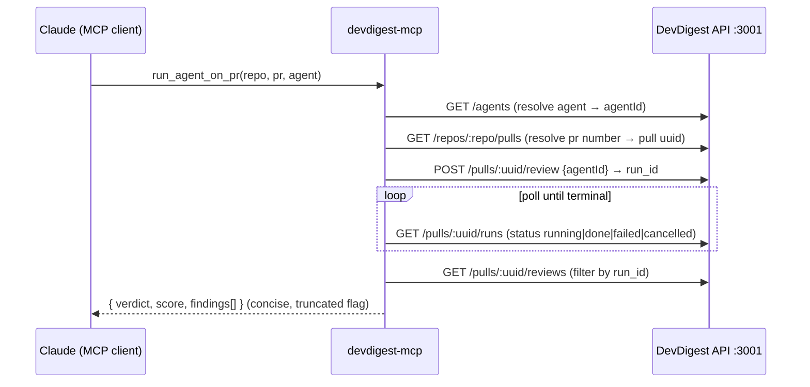

# Development Plan: `devdigest-mcp` — local MCP server (5 tools)

> **Update 2026-07-05 (post-build redesign):** the tool surface now takes internal
> IDs directly — `run_agent_on_pr(pr_id, agent_id)`, `get_findings(pr_id, all_runs?)`,
> `get_conventions(repo_id)`, `get_blast_radius(pr_id)`. No repo-slug / PR-number /
> agent-name resolution (`core/resolve.ts` removed). `get_findings` returns reviews
> **grouped by agent** (latest per agent; `all_runs` for all), `get_conventions` returns
> **accepted-only**. See `devdigest-mcp/README.md` for the current surface; the sections
> below describe the original plan.

## Context

**Why:** L04 course-lesson deliverable. We ship a new standalone package `devdigest-mcp/` at the repo root that exposes DevDigest's PR-review capabilities to Claude Code / Claude Desktop as a local **stdio MCP server**. An outer coding agent can then drive the DevDigest reviewer as a set of tools without leaving the assistant.

**What it enables:** list configured review agents, run an agent on a PR and get grounded findings back, read prior findings, read learned repo conventions, and (stubbed) inspect blast radius.

**Shape:** the MCP server is a **thin HTTP client** over the already-running API on `http://localhost:3001`. The fire-and-forget review executor lives inside the API process, so the MCP package holds *zero* domain logic — it resolves ids, calls existing routes, polls to completion, and returns concise structured results.

**Confirmed decisions:**
- Transport: **stdio only** (local). Never write to stdout — logs go to stderr (stdout is the JSON-RPC channel).
- Integration: **HTTP client to :3001**; base URL from `DEVDIGEST_API_URL` (default `http://localhost:3001`).
- SDK: official `@modelcontextprotocol/sdk` high-level `McpServer` + `registerTool` with **Zod** input schemas. Node 22 global `fetch`.
- `run_agent_on_pr` **blocks until full completion** (poll until terminal, then return findings; no client-side timeout cap, but handle terminal `failed`/`cancelled`).

### Tool-design principles honored in every tool
1. **Outcome, not operation** — `run_agent_on_pr` does create → wait → fetch internally; returns findings, not a run handle.
2. **Flat arguments** — `repo`, `pr`, `agent` as separate primitives (no nested objects).
3. **Concise structured response** — `{ verdict, findings[] }` with only needed fields + truncation flag; never a raw dump.
4. **Errors lead forward** — actionable messages ("agent not found — call list_agents"), not bare 404s.

### Token-efficiency practices baked in
Exactly 5 snake_case tools · lean `.strict()` Zod inputs with `.describe()` per field · top-level server `instructions` (≤2KB) for Tool-Search recall · return both `content` (text) + `structuredContent` (typed) · `readOnlyHint` on the 4 reads, `idempotentHint:false` + `_meta["anthropic/requiresUserInteraction"]:true` on `run_agent_on_pr` · project-scope `.mcp.json` with `${VAR}` expansion · **no** `alwaysLoad`.

## Verified API surface
- `GET /agents` → `Agent[]` (`server/src/vendor/shared/contracts/knowledge.ts:216`).
- `GET /repos/:id/pulls` → each PR has `id` (uuid) + `number`; unique on `(repoId, number)` (`server/src/modules/pulls/routes.ts:27`).
- `POST /pulls/:id/review` body `RunRequest` `{ agentId?, all? }` (`platform.ts:262`) → `{ pr_id, runs:[{run_id,agent_id,agent_name}] }` (`server/src/modules/reviews/routes.ts:27`).
- `GET /pulls/:id/runs` → `RunSummary[]` `{ run_id, status, score, findings_count, blockers, error }` (`trace.ts:98`).
- `GET /pulls/:id/reviews` → `ReviewDto[]`, each with `run_id, verdict, score, summary, findings[]{file,start_line,end_line,severity,category,title,suggestion}` (`server/src/modules/reviews/helpers.ts:18`, `routes.ts:129`).
- `GET /repos/:id/conventions` → `ConventionCandidateDto[]` `{rule,category,evidence_path,confidence,status}` (`server/src/modules/conventions/routes.ts:39`, `helpers.ts:18`).
- `BlastRadius` shape `{changed_symbols[], downstream[], summary}` (`brief.ts:39`); facade `RepoIntel.getBlastRadius` (`repo-intel/service.ts:220`) exists but has **no HTTP route** → stub is correct.
- Workspace scoping resolved server-side via `getContext` → `LocalNoAuthProvider` default workspace (`_shared/context.ts`) → **MCP tools pass no workspaceId**.

**⚠️ Spec correction (enforced in Unit 4):** `RunSummary.status ∈ {running, done, failed, cancelled}` (`trace.ts:104`) — there is **no `error` status**. Terminal set = `{done, failed, cancelled}`; treat `failed`/`cancelled` as actionable errors (surface `RunSummary.error`).

## Architecture notes
- New standalone package `devdigest-mcp/` at repo root with its own `package.json` + `pnpm-lock.yaml` (repo is **not** a pnpm workspace).
- **Onion/Fastify skills do NOT apply** — this is an outbound HTTP client, no routes/services/repos/DB/DI. Do **not** run `arch:check` here. Applicable skills: `zod`, `typescript-expert`, `security`.
- ESM throughout (`"type":"module"`), `moduleResolution:"Bundler"`, `rootDir:"src"`, relative imports carry `.js`.
- **Layering inside the package:** `src/tools/*` = thin MCP bindings (schema + annotations + call core, map to result); `src/core/*` = application logic (`resolve.ts` id resolution, `run-review.ts` trigger+poll orchestration, `findings.ts` review selection — shared by run_agent_on_pr and get_findings); `src/http-client.ts` = transport; `src/format.ts` = inbound types + compact mappers + result helpers; `src/schemas.ts` = Zod input shapes.

### Deviation from the original plan (build constraint)
- **Do NOT import `@devdigest/shared`.** The plan intended reusing `Agent`/`RunSummary`/`BlastRadius` via a tsconfig alias to `../server/src/vendor/shared/index.ts`. In practice this drags the whole contract source graph into this package's `tsc` build: with no `rootDir`, `dist/` becomes nested (`dist/server/…`, `dist/devdigest-mcp/…`) so the `bin` `dist/index.js` doesn't exist; with `rootDir:"src"`, tsc errors `TS6059` because the aliased files sit outside `src` (even for type-only imports). **Resolution:** define narrow local inbound types in `src/format.ts` (`ApiAgent`, `ApiRunSummary`, `PrRef`, `StartedRun`, `ReviewDto`, `ConventionDto`, `ApiFinding`) and drop the alias entirely. The package is fully standalone. (This is exactly the "runtime path alias" risk the plan flagged.)

## Work-units

| # | Unit | Files (all new) | Skills | Depends on | Verify |
|---|------|-----------------|--------|-----------|--------|
| 1 | Package scaffold + server bootstrap | `package.json`, `tsconfig.json`, `src/index.ts`, `src/tools/index.ts` (registrar barrel), `.gitignore` | typescript-expert | — | `pnpm -C devdigest-mcp typecheck` |
| 2 | HTTP client + Zod schemas + concise-output helpers | `src/http-client.ts`, `src/schemas.ts`, `src/format.ts` | zod, typescript-expert, security | 1 | `pnpm -C devdigest-mcp typecheck` |
| 3 | 4 read-only tools | `src/tools/list-agents.ts`, `src/tools/get-findings.ts`, `src/tools/get-conventions.ts`, `src/tools/get-blast-radius.ts` | zod, typescript-expert, security | 1,2 | `typecheck && build` |
| 4 | `run_agent_on_pr` (resolve→run→poll→findings) | `src/tools/run-agent-on-pr.ts` | zod, typescript-expert, security | 1,2 | `typecheck && build` |
| 5 | `.mcp.json` registration + README | `.mcp.json` (repo root), `devdigest-mcp/README.md` | security | 1 | Inspector loads server; `claude mcp list` |

### Unit 1 — Scaffold + bootstrap
Compiling, runnable stdio server shell with an empty tool registry + the `instructions` string; no tools yet.
- `package.json`: name `@devdigest/mcp`, `"type":"module"`, `bin:{ "devdigest-mcp":"./dist/index.js" }`, scripts `build`/`typecheck`/`dev`, deps `@modelcontextprotocol/sdk` + `zod` via `pnpm add`.
- `tsconfig.json`: copy `server/tsconfig.json` options (Bundler, ESNext, strict, `noUncheckedIndexedAccess`); `paths."@devdigest/shared"` → `["../server/src/vendor/shared/index.ts"]` (+ `/*`); `outDir:"dist"`.
- `src/index.ts`: `McpServer` with `instructions` ≤2KB (purpose + when to use); stdio transport; **log only to stderr**; call `registerAllTools(server, client)`.
- `src/tools/index.ts`: author `registerAllTools` + the frozen per-tool registrar signature `registerX(server, client)` referencing all 5 tool modules up front — so Units 3–5 only *create* files, never edit a shared one.
- Acceptance: `typecheck` passes; `node dist/index.js` starts and writes nothing to stdout before the handshake.

### Unit 2 — HTTP client + schemas + formatters
- `src/http-client.ts`: base URL `process.env.DEVDIGEST_API_URL ?? 'http://localhost:3001'`; typed `get`/`post`; map non-2xx into **forward-leading** errors (404 → "call list_agents"; ECONNREFUSED → ":3001 not reachable — run ./scripts/dev.sh").
- `src/schemas.ts`: one `.strict()` Zod object per tool input, `.describe()` on every field, flat primitives (`repo:z.string()`, `pr:z.number().int()`, `agent:z.string()`, optional `run:z.string()`); export `z.infer` types.
- `src/format.ts`: concise mappers (Agent→compact rows; `ReviewDto`→`{verdict,score,findings:[{file,start_line,end_line,severity,category,title,suggestion?}]}`; `ConventionCandidateDto`→`{rule,category,evidence_path,confidence,status}`) + a char/length **truncation helper** that trims large finding sets and sets `truncated:true`.
- security: base URL is config (safe); findings/conventions are **LLM-derived analysis of untrusted PR code** → return as opaque text, never interpolate into an executed context, cap length.
- Acceptance: `typecheck` passes; helpers callable in isolation.

### Unit 3 — Four read-only tools (`readOnlyHint:true`, return `content` + `structuredContent`)
- `list-agents.ts`: `GET /agents` → compact `{id,name,description,provider,model,enabled}[]`.
- `get-findings.ts`: flat `repo,pr,run?`; resolve pull uuid (`GET /repos/:repo/pulls` match `number===pr`); `GET /pulls/:uuid/reviews`; filter by `run` else latest by `created_at`; concise `{verdict,findings[]}` (+score).
- `get-conventions.ts`: flat `repo`; `GET /repos/:repo/conventions` → concise rows. **Default:** return `accepted`+`pending` (hide `rejected`); document default in the tool description.
- `get-blast-radius.ts`: **STUB** — flat `repo,pr`; return exact `BlastRadius` shape but empty (`changed_symbols:[], downstream:[]`) + `status:'not_implemented'` + summary noting the unwired facade. Shape matches `brief.ts:39` so the real L04 impl slots in.
- Acceptance: `typecheck && build`; in MCP Inspector each returns structured content against a seeded PR/repo.

### Unit 4 — `run_agent_on_pr` (only writing tool, blocking)
- `src/tools/run-agent-on-pr.ts`: flat `repo,pr,agent`. Resolve `agent` (id **or** name) via `GET /agents`; resolve `repo`+`pr`→pull uuid; `POST /pulls/:uuid/review {agentId}`, capture matching `run_id`; **poll** `GET /pulls/:uuid/runs` until that run's `status ∈ {done,failed,cancelled}` (bounded backoff ~1.5–3s, no client cap); on `failed`/`cancelled` return actionable error carrying `RunSummary.error`; on `done`, `GET /pulls/:uuid/reviews` filtered by `run_id` → concise verdict/findings via `format.ts` (+truncation).
- Annotations: **not** `readOnlyHint`; `idempotentHint:false`; `_meta["anthropic/requiresUserInteraction"]:true` (paid LLM run).
- Enforce spec correction: terminal set is `done|failed|cancelled`.
- Acceptance: `typecheck && build`; e2e against a seeded PR yields verdict+findings; invalid `agent` → "call list_agents".

### Unit 5 — `.mcp.json` + README
- `.mcp.json` (repo root): project-scope stdio server launching the built binary, `${DEVDIGEST_API_URL}` env expansion, **no `alwaysLoad`**, no secrets.
- `devdigest-mcp/README.md`: what it is, 5 tools + args, prereqs (`./scripts/dev.sh`), build (`pnpm -C devdigest-mcp build`), register/verify (`claude mcp list`, `npx @modelcontextprotocol/inspector`), prompt-injection caveat.
- Acceptance: Inspector connects & lists all 5 tools; `claude mcp list` shows the project server.

## Parallelization
- Sequential foundation: **1 → 2**.
- Parallel batch after Unit 2: **Unit 3 ∥ Unit 4** (independent files; both consume the Unit-2 helpers; `src/tools/index.ts` frozen in Unit 1 so no shared-file edits). **Unit 5** can ride along as a 3rd (its e2e verification runs after 3–4 build).
- Spawn 2 implementers (Unit 3 ∥ Unit 4) after 1→2 lands; optionally a 3rd for Unit 5.

## Verification (end-to-end)
1. `./scripts/dev.sh` — Postgres + migrate + seed + API on :3001. Note a seeded repo uuid + PR number.
2. `pnpm -C devdigest-mcp typecheck && pnpm -C devdigest-mcp build` (0 errors).
3. Register + load: `claude mcp list` and/or `npx @modelcontextprotocol/inspector` on `node devdigest-mcp/dist/index.js` — all 5 tools load with schemas + annotations.
4. Exercise each: `list_agents` → valid ids; `run_agent_on_pr(repo,pr,agent)` → blocks then `{verdict,score,findings[]}`; `get_findings(repo,pr[,run])`; `get_conventions(repo)` → accepted+pending; `get_blast_radius(repo,pr)` → empty shape + `status:'not_implemented'`.
5. Negative: unknown `agent` → "call list_agents"; unknown `pr` → "no PR #… in repo …"; API down → ":3001 not reachable".
6. Confirm nothing written to stdout outside the JSON-RPC channel.

No `arch:check` (scoped to server/reviewer-core only).

## Risks & open questions
- **Prompt-injection:** `run_agent_on_pr`/`get_findings`/`get_conventions` return LLM-derived analysis of untrusted PR code → opaque text, length-capped, never interpolated into an executed context. Flag in README.
- **Status vocabulary:** terminal = `done|failed|cancelled` (no `error`) — else the poll loop never terminates on failure. Enforced in Unit 4.
- **Module-local DTOs:** only `Agent`/`RunSummary`/`BlastRadius` are vendored; handle `ReviewDto`/`ConventionCandidateDto` with local narrow types/`safeParse`.
- **No timeout cap (by decision):** rely on the API's terminal transitions; add a large sanity ceiling only if a hung run is observed (deferred).
- **PR must be imported:** `GET /repos/:id/pulls` serves persisted/seeded PRs offline; unimported PR number → forward-leading "import the PR first" hint.
- **Runtime path alias:** tsconfig `paths` are compile-time only; only `import type` from `@devdigest/shared` (erased at build) — verify no value import sneaks in.
