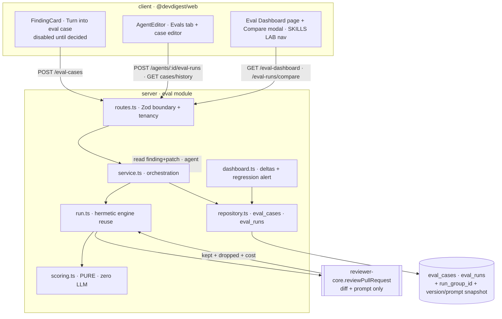

# Implementation Plan: Eval Pipeline for reviewer agents (SPEC-04)

## Goal & context
Turn DevDigest's existing accept/dismiss finding dataset into a **regression-protection harness**:
a reviewer clicks "Turn into eval case" on a decided finding to persist a Postgres eval case, runs an
agent against its whole case set hermetically, and reads back three **code-computed** metrics
(recall / precision / citation_accuracy) plus a per-case pass count. Run history + Compare (with a
system-prompt diff) and an Eval Dashboard (with a regression alert) make a prompt/model regression
visible as numbers. This is a **"wire the existing rails"** feature — tables, Zod contracts, and the
pure review engine already exist; this plan adds the missing `eval` server module, one migration, and
the studio UI that consume them. Source of truth: `specs/eval-pipeline.md` (all 9 decisions D1–D9
resolved). This document plans the *how*; it does not restate or amend the spec.

## Requirements check
Verified against the live codebase — every rail the spec claims is present:

- **Tables exist.** `eval_cases` + `eval_runs` with the needed columns (`server/src/db/schema/eval.ts:7-35`).
  `eval_runs` currently has NO `run_group_id` and NO agent-version/prompt snapshot → this is exactly
  the one net-new migration (D2).
- **Contracts exist, both copies.** `EvalCase`, `EvalRun` (+ `EvalPerTrace`), `EvalOwnerKind`
  (`server/src/vendor/shared/contracts/knowledge.ts:50-84`); `EvalCaseInput`, `EvalRunRecord`,
  `EvalRunResult`, `EvalTrendPoint`, `EvalDashboard` (`.../contracts/eval-ci.ts:20-89`). Confirmed the
  **client** copy also has `eval-ci.ts` with `EvalRunRecord`/`EvalDashboard` — the lock-step edit is real.
- **Engine reusable + pure.** `reviewPullRequest(ReviewInput)` takes `diff: UnifiedDiff` + `systemPrompt`
  + `model` + injected `llm` and returns `{ review.findings (kept), dropped[], costUsd, tokensIn/Out }`
  (`reviewer-core/src/review/run.ts:45-227`). `citation_accuracy = kept/(kept+dropped)` is **not**
  computed anywhere today — the eval module derives it (spec Assumptions, confirmed).
- **Diff string → engine input.** The engine needs a parsed `UnifiedDiff`, and a stored case holds a
  raw `input_diff` string. `parseUnifiedDiff(raw): UnifiedDiff` exists
  (`server/src/adapters/git/diff-parser.ts:14`, already re-used by `intent/helpers.ts`) — the eval
  service parses `input_diff` before calling the engine.
- **Agent config + version snapshot available.** `container.agents.get(ws, id)` returns `Agent`
  (`provider`/`model`/`system_prompt`/`strategy`/`version`); linked skill bodies via the agents service
  (`run-executor.ts:203-205`). No feature-model call needed — reuse the agent's own provider via
  `container.llm(agent.provider)`.
- **Finding → case source.** `container.reviewRepo.findingContext(id)` returns finding+review+pull
  (workspace-checkable via `pull.workspaceId`, as `actOnFinding` does — `reviews/findings.ts:17-19`);
  `getPrFiles(prId)` rows carry `path` + `patch` (`db/schema/pulls.ts:41,44`); findings carry
  `file/start_line/end_line/severity/category/title/kind/accepted_at/dismissed_at`
  (`db/schema/reviews.ts:28-45`) — everything AC-1 needs.
- **No eval module / no `verify:l06`.** `modules/index.ts` has no `eval`; `package.json` has `verify:l03`
  (`vitest run <path>`) to mirror.
- **Layered-module template** = `blast/` (`routes/service/helpers`), but eval **owns** two tables so it
  needs its own `repository.ts` (blast has none — it only reads sibling tables).

**Ambiguities surfaced (resolved with recommended defaults — see Recommendations; none block planning):**
1. Exact endpoint paths ("to confirm" in the spec).
2. How `run_group_id` + version + prompt snapshot are shaped in `EvalRunRecord`.
3. Metric behavior when a case produces **zero** findings (division-by-zero in precision/citation).
4. `verify:l06` scope (single test file vs the eval test glob).

## Recommendations
- **Endpoints (recommended defaults).**
  - `POST /eval-cases` with body `{ finding_id }` → derives owner/diff/expected/meta from the finding
    (tenancy-checked). (Alternative `POST /findings/:id/eval-case` is equally fine; pick one.)
  - `POST /eval-cases/:id` update, `GET /eval-cases?owner_kind=agent&owner_id=<id>` list,
    `DELETE /eval-cases/:id`.
  - `POST /agents/:id/eval-runs` (fixed by spec) — run all cases, return the `EvalRun` aggregate.
  - `GET /agents/:id/eval-runs` history grouped by `run_group_id`.
  - `GET /eval-dashboard` (all-agents + optional `?owner_id=` detail).
  - `GET /eval-runs/compare?a=<run_group_id>&b=<run_group_id>` → deltas + the two prompt snapshots.
- **Contract shape (D2).** Add to `EvalRunRecord` (both copies): `run_group_id: string`,
  `agent_version: z.number().int()`, `system_prompt: z.string()`. Keep the `EvalRun` **aggregate**
  metrics-only; the snapshot lives on persisted records + is echoed once per run group. Compare reads one
  row per group for the prompt (identical across a group's rows).
- **Zero-finding metric convention (pin in the pure helper).** Define precision = 1 and
  citation_accuracy = 1 when the produced set is empty (nothing wrong / nothing to ground); recall is
  over `must_find` expected findings only (a case set with no `must_find` expectations → recall = 1).
  This makes a clean `must_not_flag` pass score 1.0 across the board and avoids `0/0 = NaN` leaking into
  the aggregate. Unit-test both denominators.
- **Turn the finding→case duplicate rule into "allow duplicates, dedupe the name"** (append " (2)")
  rather than hard-rejecting — the spec leaves it open (Edge cases); duplicates are cheap and a reviewer
  may legitimately re-capture after re-deciding.
- **Keep scoring in a stand-alone pure module** (`eval/scoring.ts`, no container, no Drizzle) mirroring
  `reviewer-core/src/grounding.ts` so `verify:l06` runs it **without Docker/Postgres** — the fast tier of
  the gate. The heavier hermetic run test (MockLLMProvider) is a separate integration test.

## Execution mode
**Multi-agent (parallel implementers in isolated worktrees)** — chosen by the caller. The feature
decomposes cleanly into 7 work-units across three areas (schema/contracts, backend module, frontend)
with one hard ordering barrier (migration+contracts) and one foundational backend unit; after those two
land, up to 4 units run concurrently. Note: 7 units is slightly above the 3–6 sweet spot — justified by
the backend/frontend split and distinct file subtrees (each unit owns non-overlapping files), which is
exactly what parallel worktrees exploit. Coordination cost is concentrated in two shared backend files
(`eval/routes.ts`, `eval/service.ts`) touched by Units 4 and 5 — mitigated by giving Unit 3 ownership of
the skeleton and having Units 4/5 add their logic in separate module-internal files.

## Architecture notes
- **New layered server module `eval`** (`routes.ts → service.ts → repository.ts → db`) registered with
  ONE line in `server/src/modules/index.ts`. It is a **full** onion module (owns `eval_cases`/`eval_runs`),
  unlike thin grandfathered modules — do not copy `pulls`/`settings` inline-Drizzle style.
- **Cross-module reads via the composition root only.** The eval service reads findings/PR patches via
  `container.reviewRepo` and agent config/skills via `container.agents` — never `new ReviewRepository()`
  or importing a sibling module's service/repository (trips `arch:check`).
- **Engine reuse is hermetic (D7).** Reconstruct `ReviewInput` from the case's `input_diff`
  (parsed via `parseUnifiedDiff`) + agent config; pass NO `specs`/`intent`/`callers`/`repoMap`/
  `prDescription`. Resolve the provider with `container.llm(agent.provider)`.
- **Scoring is a pure I/O-free helper** (`eval/scoring.ts`), the same shape as `grounding.ts`.
- **One migration only** (`0014_*`): `eval_runs` gains `run_group_id`, `agent_version`, `system_prompt`
  (snapshot). Generated via drizzle-kit — never hand-written. Mirrored into both vendored contract copies.

## Relevant engineering insights
- "Shared contracts are vendored as TWO hand-maintained copies … the **client copy is a SUBSET**; add a
  field to the client copy only if the client needs it." — Evidence: `server/INSIGHTS.md`
  (2026-06-14 / 2026-06-28), `knowledge.ts` AgentVersion block. (Both copies DO have `eval-ci.ts`; still
  edit in lock-step.)
- "Editing a `vendor/shared/**/*.ts` contract is NOT enough — the server loads the committed sibling
  `.js` at runtime; regenerate the `.js` in place (`tsc … --outDir src/vendor/shared …`)." — Evidence:
  `server/INSIGHTS.md` 2026-07-09, `server/vitest.config.ts` alias.
- "`db:generate` numbers the migration off the CURRENT tree; a worktree cut from a stale `main` collides.
  Re-run `db:generate` on the actual feature branch." — Evidence: `server/INSIGHTS.md` 2026-07-09,
  `0012_slippery_talon.sql`. **Critical for worktree mode** — the migration unit's worktree MUST be cut
  from `lesson6` (current tip; latest migration is `0013`), not `main`.
- "Do NOT swallow a PRIMARY user action's error into `[]`; a user-triggered action whose whole purpose is
  the result must surface the error." — Evidence: `server/INSIGHTS.md` 2026-06-27 (conventions `extract`).
  Directly shapes AC-16 per-case error handling.
- "An integration test for an LLM feature can silently make a REAL network call if a key is configured;
  PIN the workspace feature model to the mock-backed provider." plus "drive a real run through
  `MockLLMProvider` and read the prompt back from the trace; set `repo_intel:false` for a stable
  assertion." — Evidence: `server/INSIGHTS.md` 2026-07-11 / 2026-06-27. Shapes the hermetic run test
  (AC-5/AC-8/AC-13).
- "Read a sibling TABLE through the owning container repo; importing a sibling module's CODE trips
  `arch:check`." — Evidence: `server/INSIGHTS.md` 2026-06-27/28.
- "Adding a tab to the agent editor takes THREE edits in lock-step (`TABS`, page `VALID_TABS`, editor
  body switch)." — Evidence: `client/INSIGHTS.md` 2026-06-27.
- "The sidebar nav lives in `src/vendor/ui/nav.ts` (`NAV` array); a new entry needs no further wiring." —
  Evidence: `client/INSIGHTS.md` 2026-06-27.
- "Render user/LLM text as data — `react-markdown` safe stack / `SafeDocPreview`, never
  `dangerouslySetInnerHTML`." — Evidence: `client/INSIGHTS.md` 2026-07-09. Shapes AC-14 rendering.
- "Reuse `formatCost` (`src/lib/cost.ts`) for per-run money display." — Evidence: `client/INSIGHTS.md`
  2026-06-14.
- "Per-package scripts run from inside the package dir (`pnpm -C server verify:l06`); the repo root has no
  manifest." — Evidence: `server/INSIGHTS.md` 2026-06-28.

## Work-units
| # | Unit | Package/Module | Files | Skills to apply | Covers AC | Depends on | Verification |
|---|------|----------------|-------|-----------------|-----------|-----------|--------------|
| 1 | Migration + contract lock-step (BARRIER) | server / db + vendor/shared, client / vendor/shared | `server/src/db/schema/eval.ts`, `server/src/db/migrations/0014_*.sql` (new, generated), `server/src/vendor/shared/contracts/eval-ci.ts` (+ regen `.js`), `client/src/vendor/shared/contracts/eval-ci.ts` | drizzle-orm-patterns, postgresql-table-design, zod, typescript-expert | AC-6, AC-10 (enabling) | — | `pnpm -C server db:generate` (produces `0014`), `pnpm -C server typecheck` |
| 2 | Pure scoring helper + tests + `verify:l06` | server / eval | `server/src/modules/eval/scoring.ts` (new), `server/src/modules/eval/scoring.test.ts` (new), `server/package.json` (add `verify:l06`) | onion-architecture (domain-core purity), zod, typescript-expert | AC-7, AC-8, AC-18 | — (parallel with 1) | `pnpm -C server verify:l06` |
| 3 | eval module foundation + case endpoints | server / eval (+ `modules/index.ts`) | `server/src/modules/eval/{routes,service,repository,helpers}.ts` (new), `server/src/modules/index.ts` (one line) | onion-architecture, fastify-best-practices, drizzle-orm-patterns, zod, security | AC-1, AC-4, AC-14, AC-15 | 1 | `pnpm -C server test`, `pnpm -C server arch:check` |
| 4 | Eval run endpoint (hermetic) + per-case error handling | server / eval | `server/src/modules/eval/run.ts` (new), `eval/service.ts` + `eval/routes.ts` (extend) | onion-architecture, fastify-best-practices, security, typescript-expert | AC-2, AC-5, AC-6, AC-9, AC-13, AC-16 | 1, 2, 3 | `pnpm -C server test` (incl. hermetic MockLLM run test), `pnpm -C server arch:check` |
| 5 | Dashboard / history / compare endpoints | server / eval | `server/src/modules/eval/dashboard.ts` (new), `eval/service.ts` + `eval/routes.ts` + `eval/repository.ts` (extend) | onion-architecture, fastify-best-practices, drizzle-orm-patterns, security | AC-10 (data), AC-11 (data), AC-12 (data) | 3 (coordinate shared files with 4) | `pnpm -C server test`, `pnpm -C server arch:check` |
| 6 | FindingCard "Turn into eval case" button | client / PR-detail findings | `client/src/app/repos/[repoId]/pulls/[number]/_components/FindingsPanel/FindingCard.tsx`, `client/src/lib/hooks/*` (eval mutation) | react-best-practices, react-frontend-best-practices, next-best-practices | AC-3 | 1, 3 | `pnpm -C client test`, `pnpm -C client typecheck` |
| 7 | Evals tab + case editor + Eval Dashboard page + Compare modal + nav | client / agents editor + new dashboard route | `client/src/app/agents/[id]/_components/AgentEditor/{AgentEditor,constants}.tsx` + `agents/[id]/page.tsx`, new `EvalsTab` + `EvalCaseEditor` components, new dashboard route under `app/`, `client/src/vendor/ui/nav.ts`, eval API hooks in `client/src/lib/*` | react-best-practices, react-frontend-best-practices, next-best-practices, react-testing-library, zod, security | AC-2 (UI), AC-4 (UI), AC-10 (UI), AC-11 (UI), AC-12 (UI), AC-17 (manual) | 1, 4, 5 | `pnpm -C client test`, `pnpm -C client typecheck` |

## AC coverage check
Every AC-1…AC-18 maps to ≥1 unit.
| AC | Covered by | Notes |
|----|------------|-------|
| AC-1 | Unit 3 | create-case-from-finding: derive input_diff (hunk+context, capped), expected_output, input_meta |
| AC-2 | Unit 4 (semantics), Unit 7 (UI) | must_find + must_not_flag end-to-end |
| AC-3 | Unit 6 | button disabled until finding decided |
| AC-4 | Unit 3 (list endpoint), Unit 7 (Evals tab UI) | |
| AC-5 | Unit 4 | hermetic run — no repo-intel/intent |
| AC-6 | Unit 1 (schema/contract), Unit 4 (persist per-case rows under run_group_id + snapshot; pass rule) | |
| AC-7 | Unit 2 | recall/precision/citation formulas + file-eq+range-overlap match |
| AC-8 | Unit 2 | zero LLM in scoring (pure, no provider dep) |
| AC-9 | Unit 4 | prompt-change moves metrics (demonstrated via run + snapshot) |
| AC-10 | Unit 1 (prompt snapshot column), Unit 5 (compare data), Unit 7 (Compare modal + prompt diff) | |
| AC-11 | Unit 5 (dashboard data), Unit 7 (dashboard page) | |
| AC-12 | Unit 5 (regression alert derivation), Unit 7 (`aria-live` alert UI) | |
| AC-13 | Unit 4 | untrusted diff fed via engine `wrapUntrusted`/`INJECTION_GUARD` (do not bypass) |
| AC-14 | Unit 3 (Zod `safeParse` at boundary), Unit 7 (render JSON as text, never HTML) | |
| AC-15 | Unit 3 (case tenancy), Unit 4 (run tenancy) | workspace + owning agent/finding checked |
| AC-16 | Unit 4 | per-case errored w/ reason; never bogus zero metrics / bare 500 |
| AC-17 | Unit 7 | ≥8 cases created manually — a manual screenshot deliverable |
| AC-18 | Unit 2 | `verify:l06` green |

### Unit detail

**Unit 1 — Migration + contract lock-step (BARRIER)**
- Deliverable: `eval_runs` gains `run_group_id`, `agent_version`, `system_prompt` snapshot columns via a
  drizzle-kit migration; the shape mirrored into both vendored `EvalRunRecord` copies.
- Files: `server/src/db/schema/eval.ts` (add columns — text/uuid for group id, integer version, text
  prompt; nullable to keep the migration a fast `ADD COLUMN`), generated `server/src/db/migrations/0014_*.sql`
  (new — do not hand-write), `server/src/vendor/shared/contracts/eval-ci.ts` (+ regenerated sibling `.js`),
  `client/src/vendor/shared/contracts/eval-ci.ts` (`.ts` only — client ships no `.js`).
- Skills: drizzle-orm-patterns (schema edit + `db:generate`, never hand-edit SQL); postgresql-table-design
  (nullable columns → non-rewriting `ADD COLUMN`; `run_group_id` indexed for grouping/latest resolution);
  zod (extend `EvalRunRecord` and any dashboard shape reading it); typescript-expert (keep both copies'
  inferred types aligned).
- Covers AC: AC-6, AC-10 (schema enablement).
- Insights to honor: generate the migration **in a worktree cut from `lesson6`** (latest is `0013` → this
  must be `0014`), NOT from stale `main`; **regenerate the server vendored `.js`** after the `.ts` edit or
  runtime uses the stale contract.
- Acceptance / verification: `pnpm -C server db:generate` emits `0014_*.sql` adding exactly the three
  columns; `pnpm -C server typecheck` green; grep confirms both `eval-ci.ts` copies carry the new fields.
  "Done" = migration present, both contract copies + server `.js` updated, typecheck clean.

**Unit 2 — Pure scoring helper + tests + `verify:l06`**
- Deliverable: an I/O-free scoring module computing recall / precision / citation_accuracy + per-case
  `pass`, plus its unit tests, plus the `verify:l06` script.
- Files: `server/src/modules/eval/scoring.ts` (new — pure functions: `matchFindings(produced, expected)`
  file-eq + `[start,end]` overlap; `score(...)`; `passCase(...)`; `citationAccuracy(kept, dropped)`),
  `server/src/modules/eval/scoring.test.ts` (new), `server/package.json` (`"verify:l06": "vitest run
  src/modules/eval"`).
- Skills: onion-architecture (this is domain-core-shaped purity — no container, no Drizzle, no provider
  import, mirrors `grounding.ts`); zod (import `Finding` type only); typescript-expert (a local
  `ExpectedFinding` type or reuse the `Finding` subset).
- Covers AC: AC-7, AC-8, AC-18.
- Insights to honor: keep it pure so `verify:l06` runs without Docker/Postgres; pin the zero-produced
  convention (precision/citation = 1, recall over `must_find` only) so `0/0` never reaches the aggregate.
- Acceptance / verification: `pnpm -C server verify:l06` exits 0; tests cover file-eq+overlap match,
  non-overlap/different-file = no match, must_not_flag noise, and both zero denominators.

**Unit 3 — eval module foundation + case endpoints**
- Deliverable: the `eval` module skeleton (routes→service→repository→helpers), registered; the
  create-case-from-finding endpoint and the list-cases endpoint, with tenancy + Zod validation.
- Files: `server/src/modules/eval/routes.ts`, `service.ts`, `repository.ts`, `helpers.ts` (new);
  `server/src/modules/index.ts` (+`eval` import + registry line). `helpers.ts` holds the pure
  hunk+context extraction (read the finding's `pr_files.patch` for its `path`, slice the hunk around
  `[start_line,end_line]` with N context lines, enforce the per-fragment size cap) and the
  decision→`expected_output`/`input_meta` derivation.
- Skills: onion-architecture (full layered module; read findings/patches via `container.reviewRepo`, never
  a sibling repo import); fastify-best-practices (plugin default export, Zod schemas at the boundary,
  `getContext` for workspace, delegate to service); drizzle-orm-patterns (repository queries scoped by
  `workspace_id`); zod (`EvalCaseInput.safeParse`, typed 4xx on failure — AC-14); security (A01 tenancy:
  verify agent + source finding belong to the caller's workspace before writing → not-found, AC-15; A09:
  never log `input_diff` body — it may hold secret-shaped strings).
- Covers AC: AC-1, AC-4, AC-14, AC-15.
- Insights to honor: cross-module reads via container only; primary-action errors surface (don't swallow).
- Acceptance / verification: `pnpm -C server test` (case create from accepted → non-empty expected list;
  from dismissed → empty list + guard `input_meta`; cross-workspace agent/finding → 404, nothing written;
  malformed `EvalCaseInput` → typed 4xx); `pnpm -C server arch:check` at 0 errors (no new warns).

**Unit 4 — Eval run endpoint (hermetic) + per-case error handling**
- Deliverable: `POST /agents/:id/eval-runs` runs every case in the agent's set hermetically through
  `reviewPullRequest`, scores via Unit 2, persists one `eval_runs` row per case under a shared
  `run_group_id` with the version+prompt snapshot, returns the `EvalRun` aggregate; a per-case
  model/config failure marks that case errored with a reason and continues.
- Files: `server/src/modules/eval/run.ts` (new — the per-run orchestration), extend `eval/service.ts`
  (delegate) and `eval/routes.ts` (add the route). Reuse `parseUnifiedDiff` (adapter) to turn
  `input_diff` → `UnifiedDiff`; resolve provider via `container.llm(agent.provider)`; supply NO
  `specs`/`intent`/`callers`/`repoMap`.
- Skills: onion-architecture (engine is the pure core; service owns I/O + persistence); fastify-best-
  practices (route delegates; tenancy at the boundary — AC-15); security (AC-13: pass the case diff
  through the engine's untrusted wrapping — do NOT construct a bypass path; A09 no diff-body logging);
  typescript-expert (map `ReviewOutcome` → per-case row + aggregate).
- Covers AC: AC-2, AC-5, AC-6, AC-9, AC-13, AC-16.
- Insights to honor: the integration test must PIN the workspace feature model to a `MockLLMProvider`-
  backed provider (else a real key makes a live call) and assert the hermetic prompt via the run/trace;
  per-case failure must surface a reason (never `pass:false` with fabricated zeros, never a bare 500);
  empty set → empty aggregate, no LLM call, no crash.
- Acceptance / verification: `pnpm -C server test` (must_find passes on a matching finding; must_not_flag
  fails on any overlapping produced finding; prompt change moves aggregate metrics; provider forced to
  fail → that case errored with reason, run continues); `pnpm -C server arch:check` clean.

**Unit 5 — Dashboard / history / compare endpoints**
- Deliverable: `GET /agents/:id/eval-runs` (history grouped by `run_group_id`), `GET /eval-dashboard`
  (per-agent latest metrics + recent runs across agents + trend + delta + regression alert), and
  `GET /eval-runs/compare?a=&b=` (four metric deltas + the two stored `system_prompt` snapshots).
- Files: `server/src/modules/eval/dashboard.ts` (new — read-only aggregation + regression-alert
  derivation), extend `eval/repository.ts` (grouped/latest queries), `eval/service.ts`, `eval/routes.ts`.
- Skills: onion-architecture; fastify-best-practices; drizzle-orm-patterns ("latest per owner" resolved by
  `ran_at`, grouped by `run_group_id`; all scoped by `workspace_id`); security (tenancy on every read).
- Covers AC: AC-10 (compare data + prompt-diff source), AC-11 (dashboard data), AC-12 (regression alert:
  latest precision < previous → alert string; else null).
- Insights to honor: coordinate `routes.ts`/`service.ts` edits with Unit 4 (shared files) — land Unit 4
  first or merge sequentially; the prompt diff is from STORED snapshots, never time-inferred.
- Acceptance / verification: `pnpm -C server test` (compare returns four deltas + both prompts; a
  precision-dropping run yields a non-null alert, an improving run null; dashboard latest resolves by
  `ran_at`); `pnpm -C server arch:check` clean.

**Unit 6 — FindingCard "Turn into eval case" button**
- Deliverable: a new action in the finding action row that is disabled while the finding has no
  accept/dismiss decision and, once enabled, POSTs to create the eval case.
- Files: `FindingCard.tsx` (add the action, disabled unless `accepted_at || dismissed_at`), a mutation
  hook (`useApiMutation`) alongside the existing review hooks in `client/src/lib/`.
- Skills: react-best-practices (derive disabled state from props — do not store; icon button needs
  `aria-label`); react-frontend-best-practices (colocate the small action; API call via a hook, not in
  the component body); next-best-practices (client component boundary already established here).
- Covers AC: AC-3.
- Insights to honor: API access only via `src/lib/api.ts` hooks; only "Turn into eval case" is added —
  `Learn`/`Reply` stay out.
- Acceptance / verification: `pnpm -C client test` (undecided finding → button disabled, no request;
  after accept/dismiss → enabled, fires create); `pnpm -C client typecheck`.

**Unit 7 — Evals tab + case editor + Eval Dashboard page + Compare modal + nav**
- Deliverable: the AgentEditor **Evals tab** (case list w/ per-case pass/fail + "Run all evals" + "New
  eval case"), the eval-case editor modal (Diff/Files/PR-meta input tabs, `expected_output` JSON with a
  skeleton, run-on-save), the **Eval Dashboard** page as a new SKILLS-LAB nav entry (all-agents list +
  per-agent detail with metric trend + recent-runs table + Compare modal with prompt diff + regression
  alert).
- Files: `AgentEditor.tsx` + `constants.ts` + `agents/[id]/page.tsx` (the 3-edit tab rule), new
  `EvalsTab`/`EvalCaseEditor` components (private `_components`), a new dashboard route under `app/`,
  `client/src/vendor/ui/nav.ts` (+ NAV entry under SKILLS LAB), eval API hooks + component tests.
- Skills: react-best-practices (declarative components, data in hooks, no derived state in `useState`);
  react-frontend-best-practices (feature-folder colocation; app-router `app/` for routing only, logic in
  components/hooks); next-best-practices (route/page conventions, client boundary at interactive leaves);
  react-testing-library (flow tests: tab lists cases incl. "never run"/"expected 0"; compare shows deltas
  + prompt diff); zod (consume shared contracts, never hand-duplicate types); security (render
  `expected_output`/`actual_output` as TEXT — never `dangerouslySetInnerHTML`, AC-14; a11y: metric values
  as text not color-only, trend has a table alternative, Compare modal traps focus + Escape + visible
  Close, `aria-live="polite"` alert, `aria-label` on icon-only row buttons).
- Covers AC: AC-2 (UI), AC-4 (UI), AC-10 (UI), AC-11 (UI), AC-12 (UI), AC-17 (manual demonstration).
- Insights to honor: the 3-edit tab rule (TABS + VALID_TABS + body switch) or the tab is dead; the NAV
  entry needs only a `{key,label,icon,href,gKey}` row; reuse `formatCost`; reuse the safe-markdown/text
  rendering stack for user/LLM JSON.
- Acceptance / verification: `pnpm -C client test` + `pnpm -C client typecheck`. The ≥8-case + "prompt
  diff moves metrics / break the prompt → precision drops" story is a MANUAL screenshot deliverable
  (AC-9 + AC-12 provide the mechanism).

## Parallelization map
- **Parallel batch A** (no shared files): **Unit 1** (migration + contracts) and **Unit 2** (pure scoring
  + `verify:l06`). Unit 2 touches only new `eval/scoring*.ts` + `package.json`; Unit 1 touches
  schema/contracts — no overlap.
- **Barrier:** Unit 1 must merge before any unit that reads the new `eval_runs` columns or the extended
  `EvalRunRecord` (Units 3, 4, 5, 6, 7). Only ONE unit generates a migration (Unit 1) — do not let any
  other unit run `db:generate` (avoids the numbering collision).
- **After Unit 1:** **Unit 3** (module foundation) — the second foundational unit; owns
  `eval/routes.ts` + `service.ts` skeleton.
- **Parallel batch B** (after Unit 3 lands; Unit 2 also merged): **Unit 4**, **Unit 5**, **Unit 6**,
  **Unit 7**. Units 4 and 5 both extend the shared `eval/routes.ts`/`service.ts` — land **Unit 4 first,
  then Unit 5** (or assign both to one implementer) to avoid a merge conflict; Units 6 and 7 are in the
  `client/` tree (disjoint from backend and from each other's primary files) and run fully in parallel.
  Units 6/7 can scaffold against the contracts as soon as Unit 1 lands but only wire live once Units 3/4/5
  expose endpoints.
- **Suggested implementers to spawn at once:** 2 (batch A) → 1 (Unit 3) → up to 4 (batch B, with 4→5
  sequenced). Practical peak concurrency ≈ 3.

## Verification (whole task)
Run per-package from inside each package dir (no repo-root manifest):
- `pnpm -C server db:migrate` (apply `0014`), `pnpm -C server typecheck`, `pnpm -C server test`,
  `pnpm -C server arch:check` (0 errors, no new warns), `pnpm -C server verify:l06` (exit 0).
- `pnpm -C client typecheck`, `pnpm -C client test`.
- `cd reviewer-core && npm run arch:check` (unchanged — the engine is only consumed, not edited; confirms
  purity was not broken by a stray import).
- Manual demonstration (AC-17/AC-9/AC-12): create ≥8 cases (mix of must_find/must_not_flag) via the
  button, run the set on the current prompt, edit the prompt, re-run, screenshot the Compare prompt diff +
  moved metrics + the regression alert.

## Risks & open questions
- **Worktree migration numbering (highest risk).** In multi-agent mode the Unit 1 worktree MUST be cut
  from `lesson6` (current tip; latest migration `0013`) so `db:generate` emits `0014`. A worktree cut from
  `main` would renumber and collide, and its drizzle snapshot would miss lesson-only tables
  (`server/INSIGHTS.md` 2026-07-09). If the orchestrator cannot guarantee a current-branch worktree,
  implement Unit 1 **in-tree** and let the others branch from it.
- **Vendored `.js` regeneration.** Unit 1 must regenerate the server-side sibling `.js` for `eval-ci.ts`
  or Units 3–5 will parse against the stale runtime contract (symptoms: `undefined` fields / 500s).
- **Shared backend files (Units 4 & 5).** Both extend `eval/routes.ts` + `service.ts`; the plan isolates
  their new logic into `run.ts`/`dashboard.ts`, but the route registrations still collide — sequence 4→5
  or give both to one implementer.
- **Hermetic test hygiene.** The Unit 4 integration test can silently hit the network if a real provider
  key exists locally — it MUST pin the workspace feature model to the mock provider
  (`server/INSIGHTS.md` 2026-07-11).
- **Zero-finding / empty-set metric convention** is a design choice (see Recommendations) not dictated by
  the spec — confirm precision/citation = 1 on an empty produced set is the desired reading before Unit 2
  ships; it propagates into dashboard/compare deltas.
- **Endpoint paths + `EvalRunRecord` field names** are recommended defaults, not spec-fixed — confirm so
  the client hooks (Units 6/7) and backend (Units 3–5) agree on one contract.
- **Grounding-exempt findings** (secret_leak/lethal_trifecta/phantom/hook) count as "survived" in
  citation_accuracy by design — ensure Unit 2/Unit 4 treat the engine's `kept` set (already post-gate) as
  authoritative rather than re-grounding.
- **Case referencing a deleted agent** — `eval_cases.owner_id` is not FK-enforced to agents; Units 3/5
  should hide/skip orphaned cases gracefully (Edge cases), not 500.
