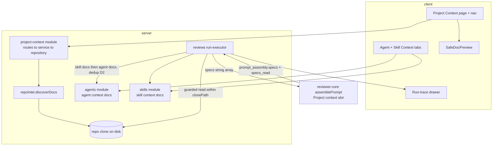

# Implementation Plan: Project Context Folder (SPEC-01)

> Source spec: `specs/SPEC-01-project-context.md` (Status: approved). This plan covers the *how*.
> The *what/why* (US-1..7, AC-1..19, Decisions D1..D9) is owned by the spec and carried through
> as AC traceability below.

## Goal & context
Turn repo-authored markdown (`specs`/`docs`/`insights`) into *reusable review context*. An author
discovers docs on a new **Project Context** page, manually attaches chosen docs to a review agent
and/or a skill, and at review time the attached docs' text is pulled from the clone and injected
into the reviewer prompt's existing untrusted **`## Project context`** slot — **zero new LLM calls**.
The engine path already exists; this feature mostly *wires* existing pieces and adds the studio UI +
the markdown discovery/attachment persistence around it.

## Requirements check
Restated and verified against the code:

- **Engine already supports it (verified).** `assemblePrompt` renders `## Project context` from
  `PromptParts.specs`, wraps each entry `wrapUntrusted('spec-<i>', …)` (which escapes a
  `</untrusted>` in the body, `reviewer-core/src/prompt.ts:59`), appends `INJECTION_GUARD` to the
  system message, and omits the section when `specs` is empty (`prompt.ts:128-131,151`). The trace
  contract already carries `prompt_assembly.specs` and `specs_read: string[]`
  (`server/src/vendor/shared/contracts/trace.ts:43,89`). **No reviewer-core or trace-contract change
  is needed (D1).**
- **The missing wire (verified).** `run-executor.ts` never passes `specs` into `reviewPullRequest`
  (`runOneAgent`, `server/src/modules/reviews/run-executor.ts:215-242`) and hardcodes
  `specs_read: []` (`:312`, and the failure-path `:486`). The trace UI *already* renders both
  `specs_read` ("Specs read") and `prompt_assembly.specs` (an expandable PromptBlock) —
  `client/.../RunTraceDrawer/_components/TraceBody/TraceBody.tsx:39-52,85-87`. So AC-14/15 are mostly
  "populate the backend field"; AC-16 is a small UI addition.
- **Markdown indexing is greenfield (verified).** The repo-intel walker keys off `SUPPORTED_EXT`
  (code only; no `.md`) and skips `EXCLUDED_DIRS` (`server/src/modules/repo-intel/pipeline/walk.ts`,
  `constants.ts:14,17-26`). A new markdown walk is required, honoring `MAX_FILE_SIZE`/
  `MAX_INDEXED_FILES` but with configured root names overriding `EXCLUDED_DIRS` (D3).
- **Attachment rails mirror skills (verified).** `agent_skills(agentId, skillId, order)` + the
  `linkedSkills`/`setSkills` repo methods + `GET/POST /agents/:id/skills` + the SkillsTab UI are the
  exact template for agent↔doc and skill↔doc links (`server/src/db/schema/agents.ts:51-63`,
  `agents/repository.ts:192-235`, `agents/routes.ts:145-165`,
  `client/.../AgentEditor/_components/SkillsTab/SkillsTab.tsx`).
- **Client token estimate exists (verified).** `estimateTokens(text)=ceil(len/4)` in the Skill
  editor (`client/src/app/skills/[id]/_components/SkillEditor/_components/ConfigTab/constants.ts:7`);
  reuse it for the live per-doc/total estimate (AC-10) and for the trace block token volume (AC-16),
  avoiding any contract change.
- **Safe markdown render is available (verified).** `client/src/vendor/ui/primitives/Markdown.tsx`
  uses `react-markdown` v9 + `remark-gfm` with **no `rehype-raw`** (raw HTML is not rendered) and
  default `urlTransform` (strips `javascript:`), i.e. safe-by-default. The REQUIRED safe preview
  builds on this pattern rather than `dangerouslySetInnerHTML`.
- **Path-traversal read pattern exists (verified).** `readClone(clonePath, file)=readFile(join(...))`
  at `repo-intel/service.ts:762-763`. The run-time read MUST additionally *resolve-within* the clone
  (reject `../`/absolute) — that hardening is REQUIRED and is its own concern in Unit 4.

**Planner-discretion items — LOCKED by the coordinator (all 5 recommended defaults accepted as-is):**
1. Persisted lightweight doc-index vs scan-on-read → **persisted** (stable `Indexed: N · last <t>`).
2. Doc walk housed in the repo-intel facade vs the new module → **repo-intel facade** (reuses guards,
   honors "clone reached only via the facade").
3. Reindex is **synchronous** on the request (bounded scan), not a background job.
4. Token warn threshold is a **workspace setting** with default **8000** tokens.
5. AC-16 token volume is **computed client-side** from `prompt_assembly.specs` (no contract change).

**`vendor/shared/` coordination — SIGNED OFF by the coordinator.** New contracts (DiscoveredDoc,
IndexStatus, attachment DTOs, two new `settings` keys) will be added to BOTH hand-maintained vendored
copies (`server/src/vendor/shared/` and `client/src/vendor/shared/`) in lock-step — the documented
procedure for shared-contract changes (server INSIGHTS 2026-06-14 / 2026-06-28). The coordinator has
**explicitly approved** these vendored edits in Unit 1; the approved spec is the "coordination" the
do-not-touch rule requires. **The trace contract (`trace.ts`) is NOT changed (D1).**

## Recommendations
- **Persist a thin index, don't scan on every list.** Add `repo_context_docs` (a per-repo snapshot:
  path, type, size) + `repo_context_index_state` (repo_id PK, `last_indexed_at`, `files_indexed`).
  Reindex replaces the snapshot in one transaction; the list/status read the snapshot. This gives a
  meaningful "last-indexed" timestamp, cleanly distinguishes "never indexed" from "indexed, 0 docs"
  (the empty-state edge case), and makes the "missing" marker a trivial set-difference
  (attached-path ∉ snapshot). Alternative (scan-on-read + a stored timestamp) is simpler but makes
  "last-indexed" meaningless — not recommended.
- **Store attachments as PATH strings, not FKs to the snapshot.** Mirrors D6/AC-19: a doc deleted
  from the clone must keep its attachment row (flagged "missing"), so the link cannot cascade off a
  doc-index row.
- **Do the doc walk in the repo-intel facade** (`container.repoIntel.discoverDocs(repoId, rootNames)`
  → `{path,type,sizeBytes}[]`), reached from the new module via `this.container.repoIntel` (property
  access, not a static import edge — the composition-root exemption + cross-module rule, server
  INSIGHTS 2026-06-28). Keep the code walker and the doc walker as two functions sharing the guards.
- **Compute AC-16 token volume on the client** from `prompt_assembly.specs` with the same
  `estimateTokens` used in the attach UI — one consistent number, and zero trace-contract churn (D1).
- **Default token threshold = 8000**, workspace-configurable (D5). Warning is non-blocking and
  `aria-live="polite"` (AC-18 + a11y).
- **Reuse the exact skills mechanics** for both link tables and the tab UI to minimize surface area
  and match author muscle-memory; only the "missing" marker + per-doc token estimate are net-new UI.

## Execution mode
**CONFIRMED by the coordinator: multi-agent, batched.** Unit 1 (contracts + schema + migration) is
the foundational spine and lands **first**; after it, the backend (2,3,4) and frontend (5,6,7,8) units
are largely independent and run in parallel per the Parallelization map at **peak concurrency 2–3**.
This plan has **8 units** — above the 3–5 parallel sweet spot — because the spec spans four distinct
UI surfaces plus two REQUIRED safety items kept explicit; coordination cost is modest since inter-unit
file overlap is small. The Parallelization map below is **authoritative** for orchestration (which
units to spawn together, and their ordering).

## Architecture notes
- **New layered module** `server/src/modules/project-context/` (routes → service → repository),
  registered with ONE line in `server/src/modules/index.ts`. It owns the doc-index snapshot + the
  Project Context read API + the used-by count. It reaches the clone only via the repo-intel facade.
- **repo-intel facade gains a doc walk** (`discoverDocs`) — a markdown sibling to `walkClone` that
  honors `MAX_FILE_SIZE`/`MAX_INDEXED_FILES` but treats configured root names as always-scanned
  (D3, overriding `EXCLUDED_DIRS`).
- **Attachment link tables** `agent_context_docs` + `skill_context_docs` (behaviourally mirror
  `agent_skills(order)`). Agent-side endpoints live in the `agents` module, skill-side in the
  `skills` module (analogous to `/agents/:id/skills`); the new module reads both TABLES for the
  used-by count (reading a sibling table is allowed; importing a sibling module's code is not).
- **run-executor** resolves merged doc paths (skill-inherited first, then agent-attached; dedup by
  path — D2), reads each within a path-traversal guard, passes `specs: string[]` to
  `reviewPullRequest`, and sets `specs_read`. No engine change.
- **reviewer-core: untouched.** `ReviewInput.specs`, `assemblePrompt`, `wrapUntrusted`,
  `INJECTION_GUARD` all already do the job.
- **Migrations**: one drizzle-generated migration for the 4 new tables (`db:generate`, never
  hand-written). Two new `settings` keys are text/jsonb prefs (no migration — `settings` is a
  key/value bag).

## Relevant engineering insights
- "The skills feature was pre-scaffolded except one server wire … the single missing injection point
  is `runOneAgent`, just before `reviewPullRequest(...)`." — Evidence: `server/INSIGHTS.md`
  (2026-06-27), `server/src/modules/reviews/run-executor.ts:215`. Project Context is the same shape.
- "An agent run is an IMMUTABLE prompt snapshot … reads `linkedSkills` fresh on each run." —
  Evidence: `server/INSIGHTS.md` (2026-06-27), `run-executor.ts`. Doc resolution must likewise read
  attachments fresh at run time and re-read file text from the clone (AC edge: "doc changed → inject
  current content").
- "To assert a prompt section actually lands, drive a real run through `MockLLMProvider` and read it
  back from the trace … set the agent's `repo_intel:false` for stability." — Evidence:
  `server/INSIGHTS.md` (2026-06-27), `server/test/skills.it.test.ts`. This is the verification
  pattern for Unit 4 (AC-8/9/11/13/14).
- "Reuse a sibling module's SERVICE via `this.container.<svc>` (property access), never
  `new XRepository()` — reading a sibling TABLE is fine, importing sibling CODE trips arch:check." —
  Evidence: `server/INSIGHTS.md` (2026-06-27/06-28), `server/.dependency-cruiser.cjs`. Governs how
  project-context reaches repoIntel and reads the link tables for the used-by count.
- "Adding an editor tab takes THREE edits: `constants.ts` TABS + page `VALID_TABS` + editor body
  switch." — Evidence: `client/INSIGHTS.md` (2026-06-27); confirmed `agents/[id]/page.tsx:15`
  (`VALID_TABS=["config","skills"]`), `AgentEditor.tsx:24` (ternary body switch — restructure to
  support a 3rd tab).
- "Sidebar nav lives in `src/vendor/ui/nav.ts`; a new `{key,label,icon,href,gKey}` needs no further
  wiring; use `:repoId` in href for repo-scoped pages." — Evidence: `client/INSIGHTS.md`
  (2026-06-27), `client/src/vendor/ui/nav.ts`.
- "Widening a Drizzle `text({enum})` generates NO migration; a new TABLE does." — Evidence:
  `server/INSIGHTS.md` (2026-06-27). The 4 new tables need `db:generate`; new `settings` keys do not.
- "New UI strings need a key under the right `messages/en/*.json` namespace; a missing key renders
  the raw key." — Evidence: `client/INSIGHTS.md` (2026-06-14). Every new label needs an i18n entry.

## Work-units
| # | Unit | Package/Module | Files | Skills to apply | Covers AC | Depends on | Verification |
|---|------|----------------|-------|-----------------|-----------|-----------|--------------|
| 1 | Contracts + schema + migration + settings keys | server + client (vendored contracts) | `server/src/db/schema/context.ts`*(edit)*, `server/src/vendor/shared/contracts/*` + `client/src/vendor/shared/contracts/*` *(lock-step)*, `server/src/vendor/shared/contracts/platform.ts` (2 settings keys), new migration under `server/src/db/migrations/` *(generated)* | onion-architecture, drizzle-orm-patterns, postgresql-table-design, zod, typescript-expert | AC-3 (threshold+roots keys), AC-18 (threshold key) | — | `pnpm -C server db:generate` then `pnpm -C server typecheck` |
| 2 | Doc discovery + Project Context read API | server / repo-intel + new project-context | `server/src/modules/repo-intel/pipeline/walk-docs.ts` *(new)*, `repo-intel/service.ts` (facade `discoverDocs`), `server/src/modules/project-context/{routes,service,repository}.ts` *(new)*, `server/src/modules/index.ts` (+1 line) | onion-architecture, fastify-best-practices, drizzle-orm-patterns, zod, security | AC-1, AC-2, AC-3, AC-4, AC-6 | 1 | `pnpm -C server test` + `pnpm -C server arch:check` |
| 3 | Attachment API (agent + skill) + used-by + missing | server / agents + skills + project-context | `agents/{routes,service,repository}.ts`, `skills/{routes,service,repository}.ts`, `project-context/repository.ts` (used-by join) | onion-architecture, fastify-best-practices, drizzle-orm-patterns, zod | AC-6, AC-7, AC-9 (persist), AC-19 (backend) | 1 | `pnpm -C server test` + `pnpm -C server arch:check` |
| 4 | run-executor wiring + path-traversal guard (REQUIRED) | server / reviews | `reviews/run-executor.ts`, `reviews/helpers.ts` *(new guarded read helper)* | onion-architecture, security, typescript-expert | AC-8 (order+inject), AC-9 (inherit), AC-11, AC-12, AC-13, AC-14, AC-17 | 1, 3 | `pnpm -C server test` (integration: `server/test/*.it.test.ts` harness) |
| 5 | Safe markdown preview component (REQUIRED) | client | `client/src/components/SafeDocPreview/` *(new)* | react-best-practices, react-frontend-best-practices, security, react-testing-library | AC-5 | — | `pnpm -C client test` |
| 6 | Project Context page + nav | client | `client/src/app/repos/[repoId]/context/page.tsx` + `_components/*` *(new)*, `client/src/vendor/ui/nav.ts` (+1 entry), `client/src/lib/hooks/context.ts` *(new)*, `client/messages/en/context.json` *(new)* | next-best-practices, react-best-practices, react-frontend-best-practices, security | AC-1, AC-2, AC-4, AC-5 (wires U5), AC-6 | 2, 5 | `pnpm -C client test` + `pnpm -C client typecheck` |
| 7 | Context tabs (agent + skill editors) + live tokens + overflow | client | `agents/[id]/_components/AgentEditor/{AgentEditor,constants}.tsx` + page `VALID_TABS`, `skills/[id]/_components/SkillEditor/{SkillEditor,constants}.tsx` + page, new `ContextTab/` under each editor, `client/src/lib/hooks/context.ts`, i18n | react-best-practices, react-frontend-best-practices, next-best-practices, react-testing-library, typescript-expert | AC-7, AC-8 (UI order), AC-9 (skill UI), AC-10, AC-18, AC-19 (UI) | 3 | `pnpm -C client test` + `pnpm -C client typecheck` |
| 8 | Run-trace project-context visibility | client | `client/.../RunTraceDrawer/_components/TraceBody/TraceBody.tsx`, `RunTraceDrawer/constants.ts`, `client/messages/en/runs.json` | react-best-practices, react-frontend-best-practices, react-testing-library | AC-14 (display), AC-15, AC-16 | 4 (for live data; UI renders from existing contract) | `pnpm -C client test` |

## AC coverage check
| AC | Covered by | Notes |
|----|------------|-------|
| AC-1 (list every matching .md w/ path+badge) | U2, U6 | walker + page render |
| AC-2 (index status, no chunks) | U2, U6 | `Indexed: N · last <t>`, no chunk count (D8) |
| AC-3 (configurable roots override EXCLUDED_DIRS) | U1, U2 | setting key + walker precedence (D3) |
| AC-4 (refresh/reindex) | U2, U6 | reindex endpoint + refresh button |
| AC-5 (safe rendered preview) | U5, U6 | REQUIRED; no rehype-raw, deny `javascript:` |
| AC-6 (used-by N agents, direct + inherited) | U3, U6 | join over link tables (D9) |
| AC-7 (toggle persists agent attach) | U3, U7 | mirrors agent_skills |
| AC-8 (order preserved; merge D2 at inject) | U4, U7 | skill-first then agent, within-group order |
| AC-9 (skill attach persists + inherited at assembly) | U3, U4, U7 | inherited placed before agent docs |
| AC-10 (live per-doc + total token estimate) | U7 | client `estimateTokens`, no round-trip |
| AC-11 (read from clone + inject, 0 new LLM) | U4 | pass `specs`; LLM count unchanged |
| AC-12 (unreadable doc omitted, run continues) | U4 | guarded read returns null → skip |
| AC-13 (untrusted wrap + injection guard) | U4 | reused engine; U4 only supplies `specs` |
| AC-14 (specs_read lists injected paths) | U4, U8 | populate field + display |
| AC-15 (expandable full injected text) | U8 | `prompt_assembly.specs` PromptBlock, relabel |
| AC-16 (token volume of injected block) | U8 | client estimate over the block (no contract change) |
| AC-17 (finding cites attached spec on violation) | U4 | behavioral outcome of AC-11/13; verify via integration/e2e |
| AC-18 (overflow warning, no auto-drop) | U1, U7 | threshold setting + non-blocking warning |
| AC-19 (missing marker, no auto-detach) | U3, U7 | attached-path ∉ snapshot → "missing" |

### Unit detail

**Unit 1 — Contracts + schema + migration + settings keys**
- Deliverable: All shared types + DB tables the feature needs, so every other unit compiles against
  a stable contract.
- Files: `server/src/db/schema/context.ts` *(add tables)* — `agent_context_docs(agent_id, path,
  order)`, `skill_context_docs(skill_id, path, order)` (PK per pair, mirror `agent_skills`);
  `repo_context_docs(repo_id, path, type, size_bytes)` snapshot; `repo_context_index_state(repo_id
  PK, last_indexed_at, files_indexed)`. New contract file (e.g. `contracts/context.ts`) exporting
  `DiscoveredDoc`, `IndexStatus`, `AgentContextLink`/`SkillContextLink` DTOs — added to **both**
  vendored copies in lock-step (add to client copy only what the client consumes). Two new
  `SettingsKnown` keys in `platform.ts` (both copies): `context_root_names: string[]`
  (default `['specs','docs','insights']`), `context_token_warn_threshold: number` (default 8000).
  Generated migration under `server/src/db/migrations/` (via `db:generate` — never hand-written).
  **Coordinator sign-off recorded:** the vendored `server/`+`client/` `vendor/shared/` edits here are
  explicitly approved; `trace.ts` stays unchanged (D1).
- Skills: drizzle-orm-patterns + postgresql-table-design (path stored as `text`; per-repo indexes on
  `repo_id`; attachment PK `(agent_id, path)` / `(skill_id, path)` so re-attach upserts order);
  zod (`.default()` on the new settings so reads are total; DTOs `type`-enum `['specs','docs',
  'insights']`); typescript-expert (`z.infer` exports, no hand-duplicated types).
- Covers AC: AC-3, AC-18 (config surface only; behaviour lands in U2/U7).
- Insights to honor: "shared contracts are TWO hand-maintained copies … edit both in lock-step; the
  client copy is a SUBSET" (server INSIGHTS 2026-06-14/06-28); "a new TABLE needs `db:generate`;
  widening an enum does not" (server INSIGHTS 2026-06-27). **Do NOT touch `trace.ts` (D1).**
- Acceptance / verification: `pnpm -C server db:generate` produces one migration; `pnpm -C server
  typecheck` and `pnpm -C client typecheck` both pass.

**Unit 2 — Doc discovery + Project Context read API**
- Deliverable: Discover markdown under configured roots and expose the list + index status + reindex
  for the active repo.
- Files: `repo-intel/pipeline/walk-docs.ts` *(new)* — recursive `.md` walk honoring `MAX_FILE_SIZE`
  + `MAX_INDEXED_FILES`, skipping `EXCLUDED_DIRS` **except** any dir whose name matches a configured
  root (always scanned, even nested below an excluded parent — D3); derive `type` from the matched
  root folder name; skip oversized/binary as the code walker does. `repo-intel/service.ts` —
  `discoverDocs(repoId, rootNames)`. `project-context/{routes,service,repository}.ts` *(new)*:
  `GET /repos/:id/context/docs` (list w/ path, type, size, used-by, coverage `—` placeholder D7),
  `GET /repos/:id/context/index-state` (files + last-indexed only, NO chunk count — D8),
  `POST /repos/:id/context/reindex` (synchronous rescan → replace `repo_context_docs` snapshot in a
  tx + bump `repo_context_index_state`). `modules/index.ts` +1 line.
- Skills: fastify-best-practices (Zod at the boundary, `getContext` for tenancy, `IdParams`);
  onion-architecture (routes→service→repository; reach the clone ONLY via `this.container.repoIntel`,
  never a static repo-intel import); drizzle-orm-patterns (snapshot replace in a transaction);
  security (walker returns repo-relative POSIX paths; never surface absolute clone paths).
- Covers AC: AC-1, AC-2, AC-3, AC-4, AC-6 (used-by delegated to U3's repo join; wire it here).
- Insights to honor: "repo-intel reached ONLY through the facade" (server CLAUDE.md); "reuse a
  sibling module's service via `this.container.<svc>` property access" (server INSIGHTS 2026-06-28);
  reuse walker guards `MAX_FILE_SIZE`/`MAX_INDEXED_FILES` (repo-intel `constants.ts:42-43`). Empty /
  never-indexed repo → empty state, never an error (server CLAUDE.md "best-effort; omit, don't throw"
  — but a *user-triggered reindex* that fails must surface, per server INSIGHTS 2026-06-27).
- Acceptance / verification: `pnpm -C server test` (a `.md` under a configured root at any depth
  appears with the right badge; a repo-root `README.md` does not; a doc under a root nested below an
  excluded parent still appears); `pnpm -C server arch:check` at 0 errors.

**Unit 3 — Attachment API (agent + skill) + used-by + missing**
- Deliverable: Persist and read ordered doc attachments per agent and per skill, plus the used-by
  count and the "missing" flag.
- Files: `agents/repository.ts` (`linkedContextDocs`/`setContextDocs` mirroring the skills methods),
  `agents/service.ts` + `agents/routes.ts` (`GET/POST /agents/:id/context` analogous to
  `/agents/:id/skills`); same triplet in `skills/` for `GET/POST /skills/:id/context`;
  `project-context/repository.ts` used-by query joining `agent_context_docs` + (`skill_context_docs`
  ⋈ `agent_skills`) to count distinct agents per path (direct + inherited — D9). Missing flag =
  attached path ∉ current `repo_context_docs` snapshot.
- Skills: fastify-best-practices (mirror the `SetSkillsBody` "set whole ordered set OR link one"
  shape); drizzle-orm-patterns (delete-all-then-insert for `setContextDocs`, exactly as `setSkills`);
  onion-architecture (project-context repo may read the agents/skills *tables* for used-by, but must
  not import agents/skills module code — server INSIGHTS 2026-06-27 skills-Stats note).
- Covers AC: AC-6, AC-7, AC-9 (persistence half), AC-19 (backend "missing" derivation).
- Insights to honor: "do the join inside your own repository reading the sibling TABLE; importing a
  sibling module's CODE trips arch:check" (server INSIGHTS 2026-06-27); attachments store PATHS not
  FKs so a deleted doc keeps its row (D6).
- Acceptance / verification: `pnpm -C server test` (attach → read back ordered; attach same path to
  a skill an agent loads → used-by N=2; delete doc from snapshot → attachment flagged missing, not
  removed); `pnpm -C server arch:check`.

**Unit 4 — run-executor wiring + path-traversal guard (REQUIRED)**
- Deliverable: At review time, resolve merged doc paths, safely read their text from the clone, inject
  as `specs`, and record `specs_read`.
- Files: `reviews/run-executor.ts` (`runOneAgent`, at the existing skills-resolution site ~`:203-236`
  and the `reviewPullRequest({...})` call + the `specs_read:` assignment `:312`); a small guarded read
  helper in `reviews/helpers.ts` *(new fn)* — `resolve(clonePath, path)`, reject absolute paths and
  any resolved path not strictly within `resolve(clonePath)+sep` (reuse the `readClone` join pattern
  at `repo-intel/service.ts:762`, adding the within-clone assertion). Merge per D2: skill-inherited
  doc paths first (from linked+enabled skills, in their configured order), then agent-attached (in
  its order), dedup by repo-relative path keeping the first (skill) position. Read each; on read
  error omit + continue (AC-12). Pass `...(specs.length ? { specs } : {})` (byte-identical prompt
  when empty — AC / edge "zero attached docs"). Set `specs_read` to the paths actually injected.
- Skills: security (REQUIRED path-traversal — resolve-within-clonePath, reject `../`/absolute;
  A01/A05; do NOT log full doc text into secret-redacting logs — it belongs only in the trace);
  onion-architecture (read attachments via `this.container.agentsRepo`/`skillsRepo`, no new repos);
  typescript-expert (keep the `specs?: string[]` optional-spread shape used for `skills`/`callers`).
- Covers AC: AC-8 (D2 order at injection), AC-9 (inherited before agent docs; dedup keeps skill
  position), AC-11 (0 new LLM calls — no extra provider call added), AC-12, AC-13 (engine wraps
  untrusted — verify the block shows `<untrusted source="spec-*">`), AC-14, AC-17.
- Insights to honor: "the single missing injection point is `runOneAgent` just before
  `reviewPullRequest`" and "read links FRESH each run; the trace is an immutable snapshot" (server
  INSIGHTS 2026-06-27); verification via a real `MockLLMProvider` run + trace readback with the
  agent's `repo_intel:false` for stability (server INSIGHTS 2026-06-27, `server/test/skills.it.test.ts`).
- Acceptance / verification: `pnpm -C server test` — an integration test attaches docs (+ a
  skill-inherited doc), runs a mock review, asserts `prompt_assembly.specs` contains the doc bodies
  under `<untrusted source="spec-*">` in D2 order, `specs_read` equals the injected paths, a deleted
  doc is absent while others remain, and a `../etc/passwd`-style path is rejected.

**Unit 5 — Safe markdown preview component (REQUIRED)**
- Deliverable: A reusable component that renders arbitrary repo markdown safely (no script/HTML
  execution, no `javascript:` links).
- Files: `client/src/components/SafeDocPreview/` *(new: component + index barrel + test)*, built on
  the `Markdown.tsx` pattern (`react-markdown` + `remark-gfm`, **no `rehype-raw`**, keep default
  `urlTransform` that strips dangerous protocols; never `dangerouslySetInnerHTML`). Wrap in a labeled
  landmark region (a11y).
- Skills: security (A05 stored-XSS: assert raw `<script>`/HTML is inert, `javascript:` links neutered;
  paths shown as escaped React text); react-frontend-best-practices (shared cross-route component
  under `src/components/<Name>/` with barrel — client INSIGHTS 2026-06-14); react-testing-library
  (test: a doc containing `<script>` and a `javascript:` link renders text, injects no markup, and
  the link is not a live `javascript:` href).
- Covers AC: AC-5.
- Insights to honor: "cross-route shared components live in `src/components/<Name>/` with an
  `index.ts` barrel" (client INSIGHTS 2026-06-14); the existing `Markdown` primitive is safe-by-
  default (no rehype-raw) — extend that stance, don't regress it.
- Acceptance / verification: `pnpm -C client test` — the XSS-payload test passes; no `dangerously*`
  usage in the component.

**Unit 6 — Project Context page + nav**
- Deliverable: The WORKSPACE Project Context page listing discovered docs with path, type badge,
  preview, index status, refresh, and used-by count.
- Files: `client/src/app/repos/[repoId]/context/page.tsx` + `_components/` *(new)*; nav entry in
  `client/src/vendor/ui/nav.ts` (WORKSPACE section, `href:"/repos/:repoId/context"`, a `gKey`);
  data hooks in `client/src/lib/hooks/context.ts` *(new)* over `src/lib/api.ts`; i18n
  `client/messages/en/context.json` *(new)*. Empty/"not indexed yet" state with a reindex affordance
  (never an error). Coverage ring renders `—` (D7). Uses `<SafeDocPreview>` from U5.
- Skills: next-best-practices (`app/` is routing-only — logic/UI live in feature `_components/` +
  hooks; Server Component page with client leaves for interactivity); react-frontend-best-practices
  (feature-scoped `_components`, colocated hooks); react-best-practices (data fetching in hooks,
  loading/empty/error states); security (render paths as data — React escaping).
- Covers AC: AC-1, AC-2 ("Indexed: N · last <t> ago", no "chunks"), AC-4 (refresh), AC-5 (wires
  preview), AC-6 ("Used by N agents", noting direct vs inherited).
- Insights to honor: "nav lives in `vendor/ui/nav.ts`; a new entry needs no further wiring; use
  `:repoId` in href" (client INSIGHTS 2026-06-27); "all API access through `src/lib/api.ts`", "types
  from `@devdigest/shared`" (client CLAUDE.md); "a missing i18n key renders the raw key" (client
  INSIGHTS 2026-06-14).
- Acceptance / verification: `pnpm -C client test` (RTL: docs load and render with badges + status
  line without "chunks"; refresh triggers reindex; empty state shown pre-index); `pnpm -C client
  typecheck`.

**Unit 7 — Context tabs (agent + skill editors) + live tokens + overflow**
- Deliverable: A Context tab in both editors to attach/detach/order docs, with a live per-doc + total
  token estimate, a non-blocking overflow warning, and a "missing" marker.
- Files: agent editor — `AgentEditor/constants.ts` (TABS +`context`), `agents/[id]/page.tsx`
  (`VALID_TABS` +`context`), `AgentEditor.tsx` (body switch — restructure the current ternary to
  handle a 3rd tab), new `AgentEditor/_components/ContextTab/`; skill editor — mirror the three edits
  + new `SkillEditor/_components/ContextTab/`; shared attach hooks in `client/src/lib/hooks/context.ts`;
  reuse `estimateTokens` (`ceil(len/4)`); i18n keys. Missing marker conveyed via text/`aria`, not
  color alone.
- Skills: react-best-practices (derive totals during render — do NOT store the sum in state/effect;
  keyboard-operable checkboxes + drag-reorder); react-frontend-best-practices (colocate tab under
  each editor; the attach UI mirrors `SkillsTab` structure); next-best-practices (client component);
  react-testing-library (toggle a doc → footer total changes; overflow → `aria-live` warning appears
  and nothing is auto-detached); typescript-expert (share the link DTO from `@devdigest/shared`).
- Covers AC: AC-7, AC-8 (UI order → persisted order), AC-9 (skill tab), AC-10, AC-18, AC-19 (UI
  "missing" marker).
- Insights to honor: "adding an editor tab = THREE edits or it's invisible/dead" (client INSIGHTS
  2026-06-27); reuse the `SkillsTab` attach/drag/persist pattern (`SkillsTab.tsx`); a11y NFRs
  (keyboard drag, `aria-live="polite"` total + warning) from the spec.
- Acceptance / verification: `pnpm -C client test` (toggle updates total in place, no reload;
  threshold exceeded → warning, all docs stay attached; missing doc shows a non-color marker);
  `pnpm -C client typecheck`.

**Unit 8 — Run-trace project-context visibility**
- Deliverable: In the trace drawer, surface the injected project-context block under the label
  "Project Context / attached specs" and show its token volume; keep "Specs read" showing the paths.
- Files: `client/.../RunTraceDrawer/_components/TraceBody/TraceBody.tsx` (relabel the existing
  `prompt_assembly.specs` PromptBlock; add a token-volume readout computed with `estimateTokens`
  over that block), `RunTraceDrawer/constants.ts` (color/label), `client/messages/en/runs.json`
  (label key). No contract change (D1).
- Skills: react-best-practices (derive the token count during render, no extra state);
  react-frontend-best-practices; react-testing-library (the section is expandable and shows the full
  injected untrusted text + a token count when `specs` is present; hidden when null).
- Covers AC: AC-14 (display), AC-15 (expandable full text, still `prompt_assembly.specs`), AC-16.
- Insights to honor: the trace already renders `specs_read` and `prompt_assembly.specs` — this is a
  relabel + a computed badge, NOT a new field (D1); the block is a single concatenated string, so
  per-doc boundaries come from the engine's `<untrusted source="spec-*">` wrappers (server INSIGHTS
  2026-06-27 on the flattened skills string — same shape for specs).
- Acceptance / verification: `pnpm -C client test` (Project context section expands to the full
  injected text and shows a token count when specs present; absent when null).

## Parallelization map
Multi-agent, batched (CONFIRMED). This map is authoritative for orchestration.
- **Spine (must land first): Unit 1.** Everything imports its contracts; the migration must exist
  before backend units run their tests.
- **Parallel batch A (after U1): Unit 2, Unit 3.** Different modules/files (repo-intel +
  project-context vs agents/skills link methods); the only shared file is `project-context/
  repository.ts` (U2 creates it, U3 adds the used-by query) — assign that file's ownership to
  whichever runs second, or land U2 first then U3.
- **Sequential: Unit 4** (after U1 + U3 — needs attachment reads + the merge rule).
- **Parallel batch B (frontend, independent of each other): Unit 5, Unit 8.** U5 is a pure component;
  U8 touches only the trace drawer. Both can start as soon as U1's client contracts exist (U8's live
  data needs U4, but the UI renders against the existing contract and can be built/tested with
  fixtures in parallel).
- **Parallel batch C (after their APIs): Unit 6** (needs U2 + U5), **Unit 7** (needs U3). No shared
  files between 6 and 7 except `client/src/lib/hooks/context.ts` — have one unit create it and the
  other extend, or split into `hooks/context.ts` (page reads) vs the attach hooks.
- Suggested implementers to spawn at once: **2** (batch A), then **2** (U4 alongside batch B), then
  **2** (batch C). **Peak concurrency 2–3.**

## Verification (whole task)
- `pnpm -C server db:generate` (one clean migration) → `pnpm -C server db:migrate`.
- `pnpm -C server typecheck && pnpm -C server test && pnpm -C server arch:check` (0 arch errors —
  do not grow the grandfathered warns).
- `pnpm -C client typecheck && pnpm -C client test`.
- `pnpm -C reviewer-core run arch:check` (should be unaffected — no reviewer-core edits).
- Manual/e2e sanity for AC-17: attach a spec stating an invariant, open a PR violating it, run — a
  finding cites the spec (behavioral; not a unit test).

## Risks & open questions
- **Two vendored contract copies drift.** Adding DTOs/settings keys to `server/` and `client/`
  vendor/shared out of lock-step will fail typecheck in one package. Land both in Unit 1; keep the
  client copy a subset of only what the client consumes.
- **`vendor/shared/` is "do-not-touch without coordination."** This feature unavoidably adds
  contracts there; the coordinator has signed off on the Unit 1 vendored edits and the approved
  SPEC-01 is the coordination. The trace contract stays unchanged (D1) — do not add a spec-token field.
- **arch:check on the used-by join.** project-context reading `agent_skills`/`agent_context_docs`/
  `skill_context_docs` tables is allowed; importing agents/skills *module code* is not. Keep the join
  inside `project-context/repository.ts` with a local row→DTO mapper.
- **Path-traversal guard is the security linchpin (Unit 4).** Stored paths are attacker-influenceable
  (repo content). The resolve-within-clonePath check must reject absolute paths and `../` escapes;
  test it explicitly. Also ensure doc text is not written to any secret-redacting log verbatim.
- **AC-16 token number consistency.** Computing it client-side keeps D1 intact but yields an estimate,
  not the exact tokenizer count. That matches the spec's stated acceptance ("shows a token count
  reflecting the injected docs") and the Skill-editor precedent; if an exact count is later required,
  it would need a trace-contract field (out of scope now).
- **Unit count (8) exceeds the 3–5 parallel sweet spot.** Driven by the spec's four UI surfaces + two
  REQUIRED-explicit safety units. Coordination is contained (small file overlap); batch as mapped.
- **`.gitignore` not honored** (consistent with today's walker). A configured root inside an ignored
  path is still scanned by design (D3); flag in the page copy if this surprises users.
