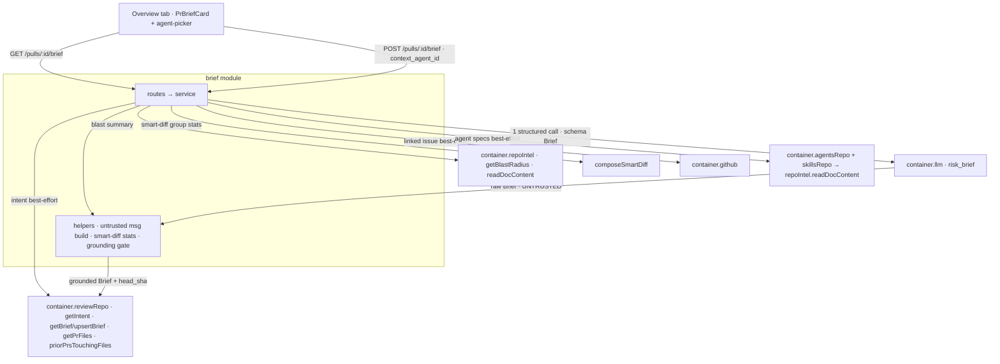

# Implementation Plan: Why+Risk Brief (SPEC-02)

> Source spec: `specs/SPEC-02-why-risk-brief.md` (Status: draft; `[NEEDS CLARIFICATION]` EMPTY,
> D1–D6 resolved). This plan covers only the *how*. The *what/why* (US-1..10, AC-1..17, D1..D6)
> is owned by the spec and carried through as AC traceability below.
>
> **Cross-model review folded in.** An independent staff-engineer review (Gemini 2.5 Pro, no chat
> access — `docs/plans/spec-02-cross-model-review.md`) raised 6 findings; all are incorporated below,
> tagged `X-review #N`: #1 concurrent-generation guard (Unit 3 + Risks), #2 input snapshot for
> reproducibility (Unit 1 + Unit 3), #3 **mandatory** shared context-doc resolver — no longer optional
> (Unit 3 + Recommendations + Risks), #4 empty-`what`/`why` output guard (Unit 3), #5 file-ref vs
> endpoint-ref client rendering (Unit 4), #6 grounding + no-secret-log test coverage (Unit 2 + Unit 3).

## Goal & context
Add ONE **PR Brief** card to the PR-Detail → Overview tab that synthesizes the reviewer's opening
questions ("what is this PR, why does it exist, how risky is it, what do I read first?") from
already-computed deterministic inputs, via **exactly one** structured LLM call, cached per-PR in the
existing `pr_brief` table and regenerated by a button. Intent and Blast Radius stay as separate
cards — they are **inputs** to the brief, not fields of it (D1). The feature is mostly **wiring**:
the `intent` module is the near-exact template, the `pr_brief` table and the `risk_brief` feature
model already exist, and the grounding + untrusted-input patterns already exist in the codebase.

## Requirements check
Restated and verified against the code:

- **`pr_brief` table exists; NO migration (verified).** `server/src/db/schema/reviews.ts:57-62` —
  `{ pr_id uuid PK → pull_requests cascade, json jsonb NOT NULL }`, currently unused by any
  repo/service. Per D3 the generation `head_sha` lives INSIDE `json`, not a new column. **No
  `db:generate` step in this plan** (a worktree cut from stale `main` mis-numbers migrations —
  server INSIGHTS 2026-07-09 — and there is nothing to generate anyway).
- **`risk_brief` feature model already registered (verified).** Spec §Rails; call
  `resolveFeatureModel(container, workspaceId, 'risk_brief')` — do NOT add a `FeatureModelId`.
- **`intent` is the exact template (verified).** `intent/{routes,service,helpers}.ts`: `GET
  /pulls/:id/intent` (cache-or-null) + rate-limited `POST /pulls/:id/intent/compute` (10/min,
  `routes.ts:28`); messages built INLINE in `helpers.ts` (no reviewer engine); `completeStructured({
  schema: Intent, schemaName, messages })`; persist via `container.reviewRepo`
  (`getIntent`/`upsertIntent`, `pull.repo.ts:95-114` + `ReviewRepository` wrapper `repository.ts:141-146`);
  PRIMARY-action error rule — rethrow `AppError`, wrap the rest in `ExternalServiceError`
  (`service.ts:72-77`). Mirror all of this for `brief`.
- **Inputs already computed (verified).** `container.reviewRepo.getIntent(prId)`; `container.repoIntel
  .getBlastRadius(repoId, changedFiles)` + `reviewRepo.priorPrsTouchingFiles(...)` (`blast/service.ts:35,42`);
  `composeSmartDiff(files, findings)` (`pulls/smart-diff.ts:26`) — file lists + `additions`/`deletions`
  only, NO diff bodies; linked issue lives on `GET /pulls/:id` (`IssueMeta`, resolved live, NOT
  persisted — `pulls/routes.ts:220-284`); designated-agent specs via
  `container.agentsRepo.linkedContextDocs(agentId)` + the agent's enabled linked skills' docs via
  `container.skillsRepo.linkedContextDocs(skillId)`.
- **Within-clone doc read via the FACADE (verified, arch-critical).** `container.repoIntel
  .readDocContent(repoId, relPath)` (`repo-intel/service.ts:669`, iface `repo-intel/types.ts:192`) is
  the path-traversal guard usable from another module (it is a facade call through `container.*`,
  NOT a cross-module import). It rejects absolute/`../` paths and THROWS on traversal/missing/unreadable —
  the brief service wraps each read in try/catch for best-effort. **Do NOT import `reviews/helpers.ts`
  `readDocWithinClone`** — that is a `reviews`-module code import and trips `arch:check`
  (`no-cross-module-internals`); the guard is intentionally duplicated exactly so the facade copy can be
  reached (server INSIGHTS 2026-07-09).
- **Grounding pattern exists (verified).** `conventions/helpers.ts` `groundCandidates` (pure, takes
  pre-read file contents as a `Map`, verifies file-exists + line-in-bounds, drops failures) mirrors
  `reviewer-core/src/grounding.ts`. The brief's gate is the same shape.
- **Contracts are TWO hand-maintained mirrors + a server `.js` sibling (verified).** `Brief`
  building blocks (`RiskSeverity` `brief.ts:47`, `Risk` `brief.ts:50-57`) already exist; the composed
  `PrBrief = {intent,blast,risks,history}` (`brief.ts:116-122`) is a DIFFERENT contract and per D1
  MUST NOT be reused. New `Brief`/`ReviewFocusItem`/`BriefResponse` go into BOTH
  `server/src/vendor/shared/contracts/` and `client/src/vendor/shared/contracts/` in lock-step, and the
  changed **server** `.ts` files must be recompiled to their sibling `.js` in place (server loads the
  committed `.js` at runtime — server INSIGHTS 2026-07-09:55); the client mirror ships no `.js`.
- **Client rails exist (verified).** `usePrIntent`/`useComputeIntent` (`client/src/lib/hooks/intent.ts`),
  `IntentCard.tsx`, `OverviewTab.tsx` (2-line card add), `useAgents()` (`client/src/lib/hooks/agents.ts:8`)
  for the picker. `client/messages/en/brief.json` EXISTS but is shaped for the OLD composition
  (`block.intent/blast/...`, `noRisks`, `why.*`) — it is NOT reusable as-is; new keys are needed.

**Planner-discretion items (spec explicitly delegates these — defaults chosen, not spec ambiguity):**
1. `outdated` server- vs client-computed → **server-computed in `GET`** (compare stored `head_sha` to
   current `pull_requests.head_sha`, `pulls/routes.ts:272`); the client renders a boolean. Single
   source of truth, no client date/sha logic.
2. Endpoint-shaped `risk.file_refs` (not a repo path) grounding → **keep a ref iff it resolves to a
   changed/clone file; otherwise keep it ONLY if it matches an `endpoints_affected` string from the
   blast summary; else drop.** Keeps "no dead links" (AC-6/US-8) without discarding legitimate
   endpoint labels.
3. Line-bounds source for `review_focus.file:line` → read the cited file's content best-effort via
   `container.repoIntel.readDocContent`; if the clone is unavailable, ground by
   path-exists-in-changed-files only and drop the `line` (never fail generation — AC-11).

## Recommendations
- **Store a SUPERSET json, return a shaped response.** Persist
  `BriefStored = Brief & { head_sha, generated_at, model?, cost?, tokens?, inputs }` in `pr_brief.json`
  (`inputs` = a compact snapshot of the deterministic inputs actually fed to the model — intent text,
  blast summary, issue title/body, resolved spec paths+bodies, smart-diff group stats — so any brief is
  reproducible/debuggable; the brief has no run-trace like reviews do — **X-review #2**);
  `GET`/`POST` return `BriefResponse = { brief: Brief | null, head_sha, outdated, generated_at,
  model?, cost?, tokens? } | null` (the `inputs` snapshot stays server-side, NOT in the response).
  This mirrors `BlastRadiusResponse` (contract adds UI/observability fields around the core,
  `review-api.ts:85-97`) and keeps the grounded `Brief` clean.
- **Keep the grounding gate PURE and in its own helper** (Unit 2), taking a `Map<path, contents>` +
  the changed-files set + blast endpoints, exactly like `groundCandidates`. Read the files
  (best-effort) in the service, pass contents in — unit-testable without Docker/clone.
- **MANDATORY (X-review #3): extract the D2 doc-merge into a shared resolver — do NOT duplicate it.**
  The skill-inherited+agent merge lives inline (private) in `run-executor.runOneAgent` (`:210-248`).
  Hand-copying it into the brief service guarantees future drift: the brief would silently inject a
  DIFFERENT project context than the review run for the same agent, breaking user trust (US-10). So
  Unit 3 MUST expose `resolveContextDocPaths(agentId)` on the agents service (against
  `container.agentsRepo.linkedContextDocs` + enabled linked skills' `container.skillsRepo
  .linkedContextDocs`, dedup keeping first — D2 order) and switch BOTH `run-executor` and the new
  `brief/service.ts` to call it. This is a behavior-preserving refactor — the existing
  `context-docs.it.test.ts` must stay green.
- **Reuse `useAgents()` for the picker** — agents in this app ARE the review agents; no new
  list endpoint. The picker sends the chosen id as `context_agent_id` in the `POST` body (D6).
- **Mirror the Intent card's cost/tokens row** rather than inventing a new observability surface.

## Execution mode
**Multi-agent, batched.** Unit 1 (contracts + persistence) is the spine and lands first. After it,
the backend-pure helpers (Unit 2) and the entire client surface (Unit 4) are independent — different
packages, zero shared files — and run in parallel. Unit 3 (service + routes) lands after Unit 1 + 2.
**4 work-units, peak concurrency 2.** Small unit count is appropriate: this is a single card + a
single 2-route module closely templated on `intent`; over-splitting would add coordination cost for
no isolation gain.

## Architecture notes
- **New layered module** `server/src/modules/brief/{routes,service,helpers}.ts` + ONE line in
  `server/src/modules/index.ts`. Fully layered (routes → service → repository-via-container), NOT a
  thin module. Reaches all cross-cutting data via `container.*` (reviewRepo / repoIntel / agentsRepo /
  skillsRepo / llm / the agents **service** for the shared `resolveContextDocPaths` — expose it on the
  container with a getter mirroring `container.intent` if not already exposed, per the composition-root
  pattern) — never a cross-module code import (server INSIGHTS 2026-06-28, 2026-07-09).
- **Persistence reuses `pr_brief`** via new `getBrief`/`upsertBrief` on `reviews/repository/pull.repo.ts`
  + the `ReviewRepository` wrapper (mirror `getIntent`/`upsertIntent`; `onConflictDoUpdate` on `pr_id`).
  The "declared in two places" caveat (server INSIGHTS:24) applies to the wrapper. **No migration.**
- **ONE LLM call**, messages assembled inline in `brief/helpers.ts` (never the reviewer engine),
  `completeStructured({ schema: Brief, schemaName: 'Brief', messages })`, cost/tokens read from the
  outcome (not recomputed). Grounding gate runs on the raw parsed `Brief` BEFORE persist/return.
- **No reviewer-core change**, no trace-contract change, no new `FeatureModelId`, no new column.

## Relevant engineering insights
- "To reuse ANOTHER module's data without tripping `no-cross-module-internals`, consume it via
  `this.container.<svc>` (property access), never `new XRepository()`; reading a sibling TABLE through
  the owning container repo is fine." — Evidence: `server/INSIGHTS.md` (2026-06-28),
  `server/src/platform/container.ts` (`get intent()`), `intent/service.ts`. Governs every input the
  brief module reaches for.
- "Do NOT apply best-effort/silent-swallow to a PRIMARY user action — surface the error (rethrow
  `AppError`, wrap the rest in `ExternalServiceError`); reserve `[]`/empty for genuine 'ran fine, found
  nothing'." — Evidence: `server/INSIGHTS.md` (2026-06-27), `conventions/service.ts`,
  `intent/service.ts:72-77`. Generation (`POST`) must surface failures (AC-10); each INPUT is
  best-effort (AC-11), but the RESULT is not.
- "Editing a `vendor/shared/**/*.ts` contract is NOT enough — the server loads the committed sibling
  `.js` at runtime; recompile the changed `.ts` to `.js` in place. The client mirror ships no `.js`."
  — Evidence: `server/INSIGHTS.md` (2026-07-09:55). Applies to Unit 1's server contract edits.
- "The resolve-within-clone guard is intentionally duplicated in `reviews/helpers.ts`
  (`readDocWithinClone`) and `repo-intel/service.ts` (`readDocContent`) so a NON-reviews module can
  reach a guarded read via the facade; if you change one, change both." — Evidence:
  `server/INSIGHTS.md` (2026-07-09). The brief module uses the `repoIntel.readDocContent` facade copy.
- "Apply the reviewer's 'don't trust the model's citation' gate: verify file exists + line in-bounds,
  drop failures; keep the gate PURE (no I/O) so it's unit-testable without Docker." — Evidence:
  `server/INSIGHTS.md` (2026-06-27), `conventions/helpers.ts` `groundCandidates`. The brief gate is the
  same shape (Unit 2).
- "Adding a tab to the PR-DETAIL page is TWO edits, but the brief is a CARD on the existing Overview —
  it needs only editing `OverviewTab.tsx` (add `<PrBriefCard/>`), no tab wiring." — Evidence:
  `client/INSIGHTS.md` (2026-07-05), `OverviewTab.tsx:18-33`.
- "A missing i18n key renders the raw key; `client/messages/en/brief.json` exists but is shaped for the
  OLD composition — new keys required." — Evidence: `client/INSIGHTS.md` (2026-06-14),
  `client/messages/en/brief.json`.
- "`react-markdown`/link safety + `getByRole('link')` gotcha for neutered `javascript:` hrefs." —
  Evidence: `client/INSIGHTS.md` (2026-07-09). Relevant if the card renders any markdown/links.

## Work-units
| # | Unit | Package/Module | Files | Skills to apply | Covers AC | Depends on | Verification |
|---|------|----------------|-------|-----------------|-----------|-----------|--------------|
| 1 | `Brief` contracts (both mirrors + recompile server `.js`) + `getBrief`/`upsertBrief` persistence | server + client (vendored contracts) + server/reviews repo | `server/src/vendor/shared/contracts/brief.ts` & `review-api.ts` *(edit + recompile `.js`)*, `client/src/vendor/shared/contracts/brief.ts` & `review-api.ts` *(edit, lock-step)*, `server/src/modules/reviews/repository/pull.repo.ts` *(+getBrief/upsertBrief)*, `server/src/modules/reviews/repository.ts` *(+wrapper methods)* | zod, drizzle-orm-patterns, postgresql-table-design, typescript-expert, onion-architecture | AC-7 (shape) | — | `pnpm -C server typecheck` + recompile `.js` (see detail) + `pnpm -C client typecheck` |
| 2 | brief pure helpers — untrusted message builder, smart-diff stats formatter, grounding gate | server / brief | `server/src/modules/brief/helpers.ts` *(new)*, `server/src/modules/brief/helpers.test.ts` *(new)* | onion-architecture, typescript-expert, security | AC-6, AC-12 (no findings in prompt), AC-13, AC-15 | 1 | `pnpm -C server test` (unit-test the pure gate + formatter) |
| 3 | brief service + routes + registration (input assembly · 1 LLM call · grounding · persist · outdated · guards) + mandatory D2 resolver refactor | server / brief + agents + reviews | `server/src/modules/brief/{service,routes}.ts` *(new)*, `server/src/modules/index.ts` *(+1 line)*, `server/src/modules/agents/service.ts` *(+`resolveContextDocPaths`)*, `server/src/modules/reviews/run-executor.ts` *(use shared resolver)*, `server/test/brief.it.test.ts` *(new)* | onion-architecture, fastify-best-practices, zod, security, typescript-expert | AC-2, AC-6 (wire), AC-7, AC-8 (server outdated), AC-9, AC-10, AC-11, AC-13, AC-14, AC-16 | 1, 2 | `pnpm -C server test` (incl. `context-docs.it.test.ts` still green) + `pnpm -C server arch:check` |
| 4 | client hooks + `PrBriefCard` + agent-picker + Overview wire + i18n | client | `client/src/lib/hooks/brief.ts` *(new)*, `client/src/app/repos/[repoId]/pulls/[number]/_components/PrBriefCard/` *(new + index barrel + test)*, `OverviewTab/OverviewTab.tsx` *(+card)*, `client/messages/en/brief.json` *(+keys)* | react-best-practices, react-frontend-best-practices, next-best-practices, react-testing-library, zod, security | AC-1, AC-2 (render), AC-3, AC-4, AC-5, AC-8 (badge), AC-10 (toast), AC-14 (picker), AC-17 | 1 | `pnpm -C client test` + `pnpm -C client typecheck` |

## AC coverage check
Every AC-1..17 from the spec maps to at least one unit.
| AC | Covered by | Notes |
|----|------------|-------|
| AC-1 (empty state + Generate btn) | U4 | card empty state, no spinner/error |
| AC-2 (exactly 1 LLM call → persist → populated) | U3, U4 | count via MockLLMProvider; render what/why/risk_level |
| AC-3 (risk_level color + what/why + risks + review_focus) | U4 | render all, array order |
| AC-4 (review_focus most-important-first, file+reason) | U3, U4 | service preserves array order; U4 renders in order |
| AC-5 (risk file_refs clickable + title/expl/severity) | U4 | file/endpoint links |
| AC-6 (grounding gate drops dead refs before persist/show) | U2, U3 | pure gate (U2) + wire/read files (U3) |
| AC-7 (head_sha saved in cached json) | U1, U3 | field in BriefStored; set at generate |
| AC-8 (outdated badge, no auto-regen/invalidate) | U3, U4 | server computes `outdated` in GET; U4 badge |
| AC-9 (GET → null/empty, not error) | U3 | 200 + null |
| AC-10 (generation failure surfaced, no empty write) | U3, U4 | rethrow AppError / wrap; U4 toast |
| AC-11 (missing input skipped, generation succeeds) | U3 | each input best-effort try/catch |
| AC-12 (deterministic inputs, no findings / no review run) | U2, U3 | message builder takes no findings; inputs exclude findings |
| AC-13 (only group file stats; no diff bodies) | U2, U3 | formatter emits files + add/del (+ optional hunk headers) only |
| AC-14 (context_agent_id specs via within-clone guard) | U3, U4 | read via `repoIntel.readDocContent`; picker sends id |
| AC-15 (untrusted wrap of PR/issue/specs text) | U2 | delimiter-wrap + injection guard in message builder |
| AC-16 (rate-limit POST, mirror intent) | U3 | route `config.rateLimit` (10/min) |
| AC-17 (risk color + outdated conveyed non-visually) | U4 | text/`aria` label, not color-only |

### Unit detail

**Unit 1 — `Brief` contracts + persistence (spine)**
- Deliverable: the new synthesis contracts + the `pr_brief` read/write methods every other unit
  compiles against.
- Files: `server/src/vendor/shared/contracts/brief.ts` — add `ReviewFocusItem = { file, line?, reason }`
  and `Brief = { what, why, risk_level: RiskSeverity, risks: Risk[], review_focus: ReviewFocusItem[] }`
  (reuse existing `RiskSeverity`/`Risk`; DO NOT reuse `PrBrief` — D1). `review-api.ts` — add
  `BriefResponse` ( `{ brief: Brief|null, head_sha, outdated: boolean, generated_at,
  model?, cost?, tokens? }`, mirroring `BlastRadiusResponse`'s "core + UI/observability" shape) and,
  a `BriefStored` schema = `Brief` + `head_sha`/`generated_at`/model/cost/tokens + **`inputs`** — a
  compact snapshot of the deterministic inputs fed to the model, for reproducibility (X-review #2).
  `inputs` is server-only (persisted in `pr_brief.json`), NOT part of `BriefResponse`.
  Mirror ALL of the above into `client/src/vendor/shared/contracts/{brief,review-api}.ts` (client copy
  is a SUBSET — add only what the client consumes; server INSIGHTS 2026-06-28). `pull.repo.ts` —
  `upsertBrief(db, prId, stored)` (insert `{prId, json}` `onConflictDoUpdate` on `prId`) +
  `getBrief(db, prId)` (returns parsed stored json or undefined), mirroring `upsertIntent`/`getIntent`
  (`:95-114`). `repository.ts` — `getBrief`/`upsertBrief` wrapper methods (BOTH places, INSIGHTS:24).
- Skills: zod (reuse `RiskSeverity`/`Risk`; `z.infer` exports; `line` `.optional()`); drizzle-orm-patterns
  + postgresql-table-design (jsonb upsert on the existing PK; no new column/migration);
  typescript-expert (no hand-duplicated types); onion-architecture (contracts are the domain core).
- Covers AC: AC-7 (the `head_sha` field exists in the stored shape).
- Insights to honor: server loads the committed sibling `.js` — after editing the two server `.ts`
  files, recompile in place with the exact invocation from server INSIGHTS 2026-07-09:55
  (`cd server && ./node_modules/.bin/tsc src/vendor/shared/contracts/brief.ts
  src/vendor/shared/contracts/review-api.ts --outDir src/vendor/shared --rootDir src/vendor/shared
  --module esnext --target es2022 --moduleResolution bundler --sourceMap --declaration false`).
  The client copy needs the `.ts` edit only. Vendored dirs are do-not-touch WITHOUT coordination —
  this feature unavoidably adds contracts there; the approved SPEC-02 is that coordination.
- Acceptance / verification: `pnpm -C server typecheck` and `pnpm -C client typecheck` both pass; the
  server `.js` siblings are regenerated (a value-import of `Brief` from a `.ts` with a stale/absent
  sibling `.js` throws at runtime — verify by grepping the new `Brief` export appears in `brief.js`).

**Unit 2 — brief pure helpers (message builder + smart-diff stats + grounding gate)**
- Deliverable: pure, I/O-free functions the service composes: assemble the ONE prompt from
  deterministic inputs with untrusted wrapping, format smart-diff GROUP STATS (no diff bodies), and
  the grounding gate that drops non-grounded `risk.file_refs` / `review_focus.file(:line)`.
- Files: `brief/helpers.ts` *(new)* — (a) `buildBriefMessages(inputs)` returning `ChatMessage[]`,
  wrapping PR title/body, linked-issue title/body, and each spec doc as **untrusted data, not
  instructions** (reuse the delimiter/guard idea from `reviewer-core` `wrapUntrusted`/`INJECTION_GUARD`;
  the brief builds messages inline, so embed an equivalent guard in the system message — AC-15); (b)
  `formatSmartDiffStats(smartDiff)` emitting per-group file lists + `additions`/`deletions` per file
  (at most hunk headers), NEVER `+`/`-` body lines (AC-13); (c) `groundBrief(rawBrief, changedFiles,
  fileContents, endpointsAffected)` — PURE, mirrors `groundCandidates`: keep a `risk.file_ref` iff it
  resolves to a changed/clone file (or matches an `endpoints_affected` string — see discretion item 2);
  keep a `review_focus.file` iff the file exists and (if `line` present and content available) the line
  is in-bounds else drop `line`; drop any risk/review_focus item left with NO valid file (AC-6). Add
  `brief/helpers.test.ts` *(new)* covering the gate (hallucinated path dropped, valid kept, line OOB
  dropped) — and, per **X-review #6**, EXPLICIT cases for the endpoint rule (discretion item 2): a
  non-file ref that IS in `endpoints_affected` is kept, a non-file ref that is NOT is dropped — plus the
  stats formatter (no `+`/`-` content emitted).
- Skills: onion-architecture (helpers are pure application-layer utilities — no `container`, no I/O);
  security (untrusted-wrap PR/issue/spec text; the model output is UNTRUSTED for file/line refs);
  typescript-expert (precise input DTO type — one struct with every best-effort input optional).
- Covers AC: AC-6, AC-12 (builder takes no findings and no review-run data), AC-13, AC-15.
- Insights to honor: keep the gate PURE so it unit-tests without a clone (server INSIGHTS 2026-06-27,
  `conventions/helpers.ts`); re-derive from real file lines, never trust the model's own text.
- Acceptance / verification: `pnpm -C server test` — the helper tests pass; a fabricated
  `file_refs=['does/not/exist.ts', <valid>]` yields only the valid ref; the formatted stats string
  contains no diff `+`/`-` body lines.

**Unit 3 — brief service + routes + module registration**
- Deliverable: the layered `brief` module — `GET /pulls/:id/brief` (cache read → `BriefResponse` or
  `null`, server-computed `outdated`) and rate-limited `POST /pulls/:id/brief` (generate/regenerate).
- Files: `brief/service.ts` *(new)* — mirror `IntentService`: `get(workspaceId, prId)` reads
  `reviewRepo.getBrief`, computes `outdated` = stored `head_sha` ≠ `pull.headSha`, returns
  `BriefResponse|null` (AC-9, AC-8); `generate(workspaceId, prId, contextAgentId?)` assembles the
  best-effort inputs — `reviewRepo.getIntent` (skip on absent), `repoIntel.getBlastRadius` +
  `reviewRepo.priorPrsTouchingFiles` (degraded→skip/summary), `composeSmartDiff` over
  `reviewRepo.getPrFiles` (stats via Unit 2 formatter), linked issue live via `container.github()`
  (best-effort, offline→skip), and the picker agent's specs (resolve doc paths via
  the NEW shared `container.agentsService.resolveContextDocPaths(contextAgentId)` — the mandatory
  X-review #3 refactor, see Files — read each via `container.repoIntel.readDocContent` in try/catch —
  AC-14) — each wrapped so a missing input NEVER fails generation (AC-11). Capture this assembled input
  set as the `inputs` snapshot to persist (X-review #2). Then ONE
  `llm.completeStructured({ model, schema: Brief, schemaName: 'Brief', messages })` with
  `resolveFeatureModel(container, workspaceId, 'risk_brief')`; on failure rethrow `AppError` / wrap in
  `ExternalServiceError` and DO NOT write an empty row (AC-10). **Empty-output guard (X-review #4):** if
  the (schema-valid) result has both `what` and `why` blank/whitespace, treat it as a failed generation
  — throw `ExternalServiceError` and do NOT `upsertBrief` (never overwrite a previously good brief with
  an empty shell; note per spec an empty `risks`/`review_focus` IS still valid → render "No notable
  risks flagged", so the guard keys ONLY on empty `what`+`why`). Read cost/tokens from the outcome (not
  recomputed). Run Unit 2's `groundBrief` (reading cited-file contents best-effort via
  `repoIntel.readDocContent`), attach `head_sha`/`generated_at`/model/cost/tokens + the `inputs`
  snapshot (X-review #2), `upsertBrief`, return the `BriefResponse`. **Concurrent-generation guard
  (X-review #1):** wrap `generate` in a per-`prId` in-flight guard (an in-memory `Set<prId>` on the
  service instance) so a second `POST` for the same PR while one is running returns `409 Conflict`
  ("generation already in progress") instead of firing a second (expensive) LLM call; release in a
  `finally`. (The client already disables the button during the mutation, so this is defense-in-depth,
  but it closes the double-submit / multi-client window.)
- Mandatory D2 refactor (X-review #3): also edit `server/src/modules/agents/service.ts`
  *(+`resolveContextDocPaths(agentId)`)* and `server/src/modules/reviews/run-executor.ts`
  *(replace the inline `:210-248` merge with a call to the new resolver)* so the brief and the review
  run can never drift on which docs an agent contributes. Behavior-preserving — `context-docs.it.test.ts`
  must stay green. `brief/routes.ts` *(new)* — mirror `intent/routes.ts`: `GET` schema
  `IdParams`; `POST` schema `IdParams` + `Body { context_agent_id?: string }` +
  `config: { rateLimit: { max: 10, timeWindow: '1 minute' } }` (AC-16); both `getContext` for tenancy.
  `modules/index.ts` — one import + one registry entry (`brief`). `server/test/brief.it.test.ts`
  *(new)* — trace-style integration (server INSIGHTS 2026-06-27 pattern): `POST` through
  `MockLLMProvider`, assert EXACTLY ONE call, a `pr_brief` row appears with `head_sha` = the PR head
  (AC-7), a fabricated dead `file_ref` is absent (AC-6), and a missing input (no intent / unindexed
  repo) still succeeds (AC-11). Also (X-review): an empty-`what`/`why` model result errors and does NOT
  overwrite an existing brief (#4); a logger spy asserts NO `info`+ log line contains the raw PR body /
  spec text during generate (#6.2); the stored json carries the `inputs` snapshot (#2).
- Skills: onion-architecture (routes→service; reach ALL cross-cutting data via `container.*`, never a
  `reviews`/`agents`/`skills`/`repo-intel` code import — read specs via the `repoIntel.readDocContent`
  FACADE, not `reviews/helpers.ts`); fastify-best-practices (Zod at the boundary, `getContext`,
  per-route rateLimit); zod (`Brief` schema drives `completeStructured`; validate `context_agent_id`);
  security (PRIMARY-action error surfacing AC-10; do NOT log spec/issue/PR-body text verbatim — it
  belongs only in the LLM call, not secret-redacting logs); typescript-expert.
- Covers AC: AC-2, AC-6 (wire), AC-7, AC-8 (server `outdated`), AC-9, AC-10, AC-11, AC-13, AC-14, AC-16.
- Insights to honor: PRIMARY action surfaces errors (INSIGHTS 2026-06-27); cross-module reuse via
  `container.*` only (INSIGHTS 2026-06-28/07-09); `getBlastRadius` degraded→`'none'` best-effort
  (INSIGHTS 2026-07-05); a `ConfigError` from a missing provider key must surface (INSIGHTS 2026-06-27
  #48) not become an empty brief.
- Acceptance / verification: `pnpm -C server test` (the integration test above) and
  `pnpm -C server arch:check` at 0 errors (do not grow the grandfathered warns).

**Unit 4 — client hooks + PrBriefCard + agent-picker + Overview wire + i18n**
- Deliverable: the Overview PR Brief card — empty state + Generate, populated what/why/risk_level/risks/
  review_focus, outdated badge, cost/tokens row, and the specs agent-picker.
- Files: `client/src/lib/hooks/brief.ts` *(new)* — `usePrBrief(prId)` (GET, `BriefResponse|null`) +
  `useGenerateBrief(prId)` (POST with `{ context_agent_id }`, PRIMARY → `notify.error` toast on
  failure — AC-10), mirroring `intent.ts`. `PrBriefCard/` *(new; component + `index.ts` barrel +
  `PrBriefCard.test.tsx`)* — mirror `IntentCard`: empty state "No brief yet" + "Generate a Why+Risk
  brief for this PR." + Generate button (AC-1); populated card shows `risk_level` with color AND a text
  label (e.g. "Risk: high") + `aria` (AC-17), `what`+`why`, all `risks` (title/explanation/severity +
  each `file_ref` rendered BY TYPE — a file-path ref becomes a clickable file link, an endpoint-shaped
  ref (e.g. `POST /api/public/webhooks`) renders as a NON-clickable labeled chip with an endpoint icon,
  never a dead link (X-review #5 + grounding discretion item 2) — AC-5), `review_focus` items in array order (file(:line)
  link + reason — AC-3/AC-4), a placeholder ("No notable risks flagged." — reuse/rename existing
  `noRisks`) when arrays empty, an "Outdated" badge (text/`aria`, not color-only — AC-8/AC-17) when
  `outdated`, and an optional cost/tokens/model row. Add an **agent-picker** (`useAgents()`) whose
  selection feeds `context_agent_id` before generate (D6; "none" → empty specs). `OverviewTab.tsx` —
  add `<PrBriefCard prId={prId} repoFullName={...} headSha={...} />` alongside Intent/Blast.
  `client/messages/en/brief.json` — add keys (empty/generate/regenerate/outdated/review_focus/
  risk-level labels/context-agent-picker); the existing bundle is NOT reusable as-is.
- Skills: react-best-practices (data in hooks; derive `outdated`/labels during render, no
  state-sync effect; conditional rendering guards); react-frontend-best-practices (colocated
  `_components/PrBriefCard/` with barrel; card composed of small subcomponents); next-best-practices
  (client component; `app/` stays routing-only); react-testing-library (empty→generate→populated flow
  via MSW; outdated badge present as text; error→toast); zod (consume `@devdigest/shared` types, no
  hand-dupe); security (render file paths/endpoint labels as escaped React text; if any markdown is
  rendered use the safe `Markdown` primitive — client INSIGHTS 2026-07-09; validate link protocol).
- Covers AC: AC-1, AC-2 (render), AC-3, AC-4, AC-5, AC-8 (badge), AC-10 (toast), AC-14 (picker),
  AC-17.
- Insights to honor: the card goes on the EXISTING Overview (edit `OverviewTab.tsx` only — no tab
  wiring, client INSIGHTS 2026-07-05); a missing i18n key renders raw (client INSIGHTS 2026-06-14);
  cross-route shared components rule does NOT apply (this is a PR-detail-scoped `_components/` card).
- Acceptance / verification: `pnpm -C client test` (RTL: empty state renders with a working Generate
  button and no spinner/error; after mocked generate the card shows what/why + a text risk label + all
  risks and review_focus in order; outdated response renders a text "Outdated" badge; a failed generate
  surfaces a toast) and `pnpm -C client typecheck`.

## Parallelization map
Multi-agent, batched. This map is authoritative for orchestration.
- **Spine (must land first): Unit 1.** Both packages' contracts + the persistence methods; everything
  else compiles against it. Includes the server `.js` recompile.
- **Parallel batch A (after U1): Unit 2 (server pure helpers) + Unit 4 (entire client surface).**
  Different packages, zero shared files — fully independent. U4 renders against the U1 contract and is
  testable with MSW fixtures without waiting for U3.
- **Sequential: Unit 3 (after U1 + U2)** — needs the persistence methods and the pure helpers it wires.
- Suggested implementers to spawn at once: **2** (U2 + U4 in batch A), then **1** (U3).
  **Peak concurrency 2.**

## Verification (whole task)
- **No `db:generate` / `db:migrate`** — `pr_brief` already exists; adding one would mis-number on a
  stale-`main` worktree (server INSIGHTS 2026-07-09). If any unit is later found to need a column, it
  MUST generate the migration IN-TREE on `lesson5`, not in a worktree-isolated implementer.
- Recompile the changed server vendored `.ts` → sibling `.js` (Unit 1 detail) — required before the
  server runtime/tests see the new `Brief` export.
- `pnpm -C server typecheck && pnpm -C server test && pnpm -C server arch:check` (0 arch errors).
- `pnpm -C client typecheck && pnpm -C client test`.
- `pnpm -C reviewer-core run arch:check` (unaffected — no reviewer-core edits).
- Manual/e2e sanity: open Overview on a PR with no brief → empty state; Generate → populated card;
  advance the PR head → "outdated" badge, cache unchanged (AC-8); a PR-body injection string does not
  flip risk_level (AC-15).

## Risks & open questions
- **Two vendored contract mirrors + the server `.js` sibling.** The single most common failure here:
  editing only the `.ts` (typecheck passes, runtime uses the stale `.js` → `undefined`/500). Unit 1
  MUST recompile the server `.js`; keep the client copy a subset of what the client consumes.
- **arch:check on cross-module reads.** The brief module must reach intent/blast/specs/clone ONLY via
  `container.*` (reviewRepo / repoIntel / agentsRepo / skillsRepo). Importing `reviews/helpers.ts`
  `readDocWithinClone` or any sibling module's code WILL fail `no-cross-module-internals` — use
  `container.repoIntel.readDocContent` for guarded doc reads.
- **PRIMARY-action error semantics (AC-10).** Easy to regress by copying a best-effort `catch {}` onto
  the generate path. Inputs are best-effort; the generation RESULT is not — rethrow/wrap and never
  persist an empty row.
- **Endpoint-shaped `file_refs` grounding (discretion item 2).** Default keeps a ref only if it
  resolves to a file OR matches a blast `endpoints_affected` string; if the customer wants endpoints
  ungrounded/free-text, revisit — but that risks dead links (US-8). Confirm if a stricter/looser rule
  is desired.
- **`outdated` computed server-side (discretion item 1).** Requires `GET` to load the current
  `pull_requests.head_sha`; the service already loads the pull for the workspace guard, so no extra
  query. If the client ever needs the raw sha for its own logic, `BriefResponse.head_sha` carries it.
- **D2 doc-merge duplication — RESOLVED (X-review #3).** No longer optional: Unit 3 extracts a shared
  `resolveContextDocPaths(agentId)` on the agents service and switches BOTH `run-executor` and the brief
  service to it, so the brief and the review run can never drift on an agent's context docs. Residual
  risk: the refactor touches the live review path — Unit 3 must keep `context-docs.it.test.ts` green.
- **Concurrent generation (X-review #1).** Two `POST`s for the same PR must not fire two LLM calls.
  Mitigated primarily by the client disabling the button during the mutation; hardened by a server-side
  per-`prId` in-flight guard returning `409` (Unit 3). Not a full distributed lock (single-node,
  local-first) — a Redis lock is a future upgrade if DevDigest ever runs multi-node.
- **Empty-but-valid model output (X-review #4).** A schema-valid `{ what:'', why:'', risks:[],
  review_focus:[] }` must NOT overwrite a good cached brief — Unit 3 guards on empty `what`+`why` and
  errors instead of persisting. (Empty `risks`/`review_focus` alone stays a valid "no risks" brief.)
